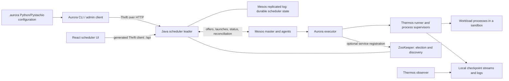

# Apache Aurora: local project context

This is a working guide for returning to this repository and experimenting with it. It records a source review, not a successful build or deployment. Research date: 2026-09-09 (America/New_York). Three subagents independently examined the Java scheduler, Python execution stack, and build/UI; their findings were cross-checked against source, tests, and Git history.

For a quick return: Aurora places job instances on Mesos; Thermos supervises their process graphs. This snapshot uses map-backed volatile storage plus the Mesos replicated log, **without local write rollback**. The most promising first scheduler experiment is its built-in fake-cluster simulator, but even that build needs legacy Python 2 code generation. Start with the build section before attempting old setup commands.

- [Mental model](#mental-model)
- [Repository map](#repository-map-and-first-reading-route)
- [Java scheduler](#java-scheduler-internals)
- [Python execution stack](#python-client-and-execution-stack)
- [UI](#ui-architecture)
- [Build and experiments](#build-and-experimentation-map)
- [Cron, maintenance and operations](#additional-scheduler-features-and-operational-boundaries)
- [History and sources](#archaeology-and-external-references)
- [Modification rules and remaining unknowns](#rules-to-preserve-and-remaining-unknowns)

## Checkout and historical status

- Repository: `/Users/jordanly/workspace/oss/aurora`, branch `master`.
- Reviewed commit: `11ebaeeb071cb182c388a40755e84f60dda32260`, dated 2020-02-21, “Apache version moved into the Attic (#106)”.
- `.auroraversion`: `0.23.0-SNAPSHOT`. This is a development snapshot; the Apache downloads page lists **0.22.0** as its newest source release.
- Existing `origin`: `https://git-wip-us.apache.org/repos/asf/aurora`. It is an historical remote; it was not changed or fetched during this review.
- The working tree was clean at the beginning. No applicable `AGENTS.md` was found in the repository or parent directories. This context document is the intended repository change.
- Apache Aurora retired in February 2020; its Attic move completed in April 2021. The Attic page links to the source, downloads, JIRA, and mailing-list archives. [Apache Attic](https://attic.apache.org/projects/aurora.html)
- The README's continuation link leads to `aurora-scheduler/scheduler`, which GitHub marks archived on April 2, 2023. Its README describes a scheduler maintenance fork and explicitly leaves the original Python 2 client unmaintained. Treat it as another historical source to compare, rather than a currently maintained replacement. [Continuation repository](https://github.com/aurora-scheduler/scheduler)
- Mesos itself retired in August 2025 and completed its Attic move in October 2025. This matters when reconstructing Aurora's dependency environment. [Mesos Attic page](https://attic.apache.org/projects/mesos.html)

## Mental model

Aurora is an opinionated service and batch scheduler **on top of Apache Mesos**. Mesos offers resources on machines; Aurora decides which job instances to place there and maintains their lifecycle. The default executor uses Thermos to supervise the processes inside each task.

The useful hierarchy is:

```text
Job: task template, replica count, ownership, scheduling/update policies
  Instance: a logical replica/shard number within the job
    ScheduledTask: one concrete execution attempt, with a unique task ID
      Thermos Task: a graph of processes sharing a sandbox
        Process: shell command, dependencies, retry/lifecycle settings
```

An instance survives conceptually across execution attempts. A rescheduled execution gets a new task ID and records its predecessor in `ancestorId`. Rolling-update replacements also get new IDs but are inserted through a different path without that ancestry field. Do not confuse an instance number with a Mesos task ID. The CLI path is `cluster/role/environment/job`; the server's `JobKey` contains only role, environment, and name, because the cluster is selected by connecting to a scheduler. The `AssignedTask` adds agent/host, instance ID, and allocated ports; `ScheduledTask` adds state, event history, failure count, and ancestry.



There are three distinct kinds of persistent/coordination state: scheduler state in the replicated log, coordination and discovery in ZooKeeper, and process state/checkpoints on each worker. ZooKeeper is not Aurora's job database. An observer is a view onto worker state, not the component making scheduling decisions.

## Repository map and first reading route

| Area | Purpose and useful entry points |
| --- | --- |
| `api/src/main/thrift/org/apache/aurora/gen/api.thrift` | Shared job/task/resource/update types, status enums, public RPC interfaces |
| `api/src/main/thrift/org/apache/aurora/gen/storage.thrift` | Durable scheduler snapshots and log operations |
| `api/src/main/thrift/org/apache/thermos/thermos_internal.thrift` | Thermos process/task checkpoint protocol |
| `src/main/java/org/apache/aurora/scheduler/` | Scheduler application, placement, state machines, updates, storage, HTTP |
| `src/main/python/apache/aurora/` | CLI/admin, configuration conversion, executor, health checking |
| `src/main/python/apache/thermos/` | Process graph runner, checkpoint recovery, observer |
| `commons/` | Vendored Java utility infrastructure, including lifecycle/ZooKeeper/testing helpers |
| `ui/` | React scheduler UI, Jest tests, webpack build, extension points |
| `src/test/java/`, `src/test/python/`, `src/test/sh/` | Unit/integration tests, local simulator, end-to-end cluster tests |
| `build.gradle`, `buildSrc/`, `gradle/` | Java/UI build and generated Thrift entities/API metadata |
| `pants`, `pants.ini`, `3rdparty/python/BUILD` | Python dependency graph, tests, and PEX binaries |
| `examples/jobs/`, `examples/vagrant/` | Example workloads and historical all-in-one development cluster |
| `docs/`, `RELEASE-NOTES.md`, `CHANGELOG` | Useful explanations and history, with some substantial drift from current code |

Suggested first pass: `docs/getting-started/overview.md` → `examples/jobs/hello_world.aurora` → `api.thrift` → `SchedulerMain` → `SchedulerThriftInterface` → `StateManagerImpl`/`TaskStateMachine` → `TaskSchedulerImpl`/`TaskAssignerImpl` → `MesosTaskFactory` → Python `aurora_executor.py` → Thermos `core/runner.py`. Read the adjacent tests whenever a transition or failure condition is unclear.

## Shared API, configuration, and identities

The RPC hierarchy is `ReadOnlyScheduler` → `AuroraSchedulerManager` → `AuroraAdmin`. Read calls cover task/job queries, quotas, pending reasons, update summaries, and configuration population. Manager calls create/kill/restart instances, manage cron templates, and control rolling updates. Admin calls add quota, backup/recovery, maintenance, explicit/implicit reconciliation, and task-state overrides.

`TaskConfig` is the scheduler-facing description: job key, resources, constraints, tier/priority, executor payload, container, service/retry behavior, partition policy, and SLA policy. The Python DSL carries additional process-level meaning that the Java scheduler does not interpret. In the normal Thermos path, `ExecutorConfig.data` contains serialized JSON configuration, while the outer assignment sent to Mesos is binary Thrift.

`http/api/ApiModule.java` exposes `/api` using Thrift JSON or binary protocols selected by HTTP content negotiation. `http/api/ApiBeta.java` exposes `/apibeta/{method}` as a POST body of ordinary JSON named parameters, dispatching through generated `AuroraAdminMetadata` into the same annotated API interface. It is an RPC-shaped JSON interface, not a REST resource model. Generated Java immutable wrappers (`IJobKey`, `ITaskConfig`, etc.) live under the generated `storage.entities` package; their absence from tracked source is expected.

Configuration facts worth retaining:

- A `.aurora` file is executable Python with Pystachio templates, not a passive YAML/JSON manifest. Loading it is code execution. Parse only trusted configurations during experiments.
- The actual default environment regex in `configuration/ConfigurationManager.java` is `^(prod|devel|test|staging\d*)$`; the multitenancy document's use of `production` is stale.
- Bundled `src/main/resources/org/apache/aurora/scheduler/tiers.json` defaults to **preemptible**. `preferred` has neither preemptible nor revocable set; `preemptible` allows preemption; `revocable` enables both flags. Environment names do not confer production scheduling guarantees.
- An Aurora role controls ownership/quota and normally the task's Unix user. It is distinct from the scheduler framework's Mesos role (`-mesos_role`). Changing `-executor_user` from root changes the executor's ability to switch to the job role.
- Resource requests and placement include executor overhead. A machine with just enough resources for the workload may still fail to fit the complete launch.
- Partition-aware behavior exists but `-partition_aware` defaults to false. Revocable offer reception also defaults to false. A configured task feature and a framework capability flag must agree.

Sources: `api.thrift`; `configuration/ConfigurationManager.java`; `http/api/{ApiModule,ApiBeta}.java`; `mesos/{CommandLineDriverSettingsModule,MesosTaskFactory}.java`; bundled `tiers.json`.

## Java scheduler internals

Paths in this section are relative to `src/main/java/org/apache/aurora/scheduler/` unless stated otherwise. Guice modules assemble the system; generated immutable Thrift entities carry most stored state; asynchronous events connect lifecycle, placement, updates and recovery.

### Boot, leadership, and Mesos connection

`app/SchedulerMain.java` and `app/AppModule.java` wire the process. `SchedulerMain.run` starts application services, prepares scheduler storage, then competes for leadership using ZooKeeper `SingletonService`. `SchedulerLifecycle` has the sequence:

```text
IDLE -> PREPARING_STORAGE -> STORAGE_PREPARED
     -> LEADER_AWAITING_REGISTRATION -> ACTIVE -> DEAD
```

Preparing storage makes the process a log replica before it becomes leader. On leadership, Aurora replays durable state, starts the Mesos driver, and starts registration/failover timers. Mesos registration persists the framework ID and signals `DriverRegistered`. Only after active services are healthy does Aurora advertise the usable leader. Losing leadership ends the process; it does not simply return to standby. A supervisor is expected to restart it.

`CallOrderEnforcingStorage` prevents ordinary access before READY. Once state is restored it emits initialization events for stored tasks, ordered by last activity. Subscribers use these to reconstruct groups, timers, and other in-memory control state. A new subscriber needs both a live-event path and a restart path.

`SchedulerMain.Options.DriverKind` defaults to **SCHEDULER_DRIVER**, the original driver. V0_DRIVER and V1_DRIVER alternatives exist. Much internal code uses V1 protobufs, with `MesosSchedulerImpl` adapting the legacy driver and `VersionedMesosSchedulerImpl` handling the newer interface. V1 types in a class do not establish that the HTTP driver is active.

### Storage: current implementation and its guarantees

```text
CallOrderEnforcingStorage
  -> DurableStorage
       -> WriteRecorder -> @Volatile MemStorage / map-based stores
       -> Persistence -> LogPersistence -> log framing/streams -> Mesos log
```

`SchedulerMain.getUniversalModule` installs `MemStorageModule`; production `main` adds durability/log/snapshot modules. There is **no H2/MyBatis store or selectable database implementation in this checkout**. `docs/operations/storage.md`, some module comments, and `DurableStorage`'s local-transaction Javadoc retain outdated descriptions.

`DurableStorage.write` takes a global reentrant writer lock. The outermost call creates a `TransactionRecorder`; nested writes share it. `WriteRecorder` immediately changes volatile stores and records Thrift log operations. After the work completes, those operations are persisted together. A successful outer write therefore includes persistence, but local mutation occurs before it.

**Local writes do not roll back on exceptions.** `MemStorage.write` directly calls the supplied function, and `Storage.read` explicitly permits uncommitted reads from concurrent writers. `src/test/java/org/apache/aurora/scheduler/storage/mem/StorageTransactionTest.java` asserts that failed/nested writes remain visible. Commit `f2755e1cd` explicitly describes removal of local transactional semantics and dependence on log atomicity plus failover after storage failure. `log/mesos/MesosLog.java` disables the writer and initiates shutdown on native log mutation failure. This is not evidence that every arbitrary application exception after a mutation triggers failover; do not rely on that when adding write logic.

`MemTaskStore` indexes tasks by task ID, job and host and interns equal configurations. Reads are individually thread-safe, not globally isolated across multiple queries or indices. Large scans and work inside the single-writer critical section matter to scheduler throughput.

Recovery reads log transactions and snapshots through `LogPersistence`, `Loader`, and `ThriftBackfill`, applying them directly to volatile stores without logging them again. Snapshot application clears state then loads snapshot-derived operations. Stream framing handles checksums, compression, incomplete frames and deduplicated snapshots. Snapshots are appended before old log positions are truncated. `SnapshotterImpl`, `SnapshotService`, `storage/backup/StorageBackup`, and the recovery tool are the next layer to read before modifying durability. Thrift operation/snapshot compatibility is part of the storage interface.

### Placement from PENDING to launch

1. `thrift/SchedulerThriftInterface.createJob` validates/sanitizes the request and checks quota. `state/StateManagerImpl.insertPendingTasks` checks active instance-ID collisions, creates unique attempts in INIT, saves them, then transitions to PENDING.
2. `scheduling/TaskGroups` receives task events and groups pending attempts by equal `TaskConfig`, rather than just job identity. Different versions during a rollout form different groups. Batching, rate limits, delays and backoff control scheduling effort and fairness.
3. `scheduling/TaskSchedulerImpl.scheduleTasks` re-reads current PENDING state and checks group configuration equality. It computes job attribute aggregates and a resource request including tier semantics and executor overhead.
4. `scheduling/TaskAssignerImpl` honors update affinity and preemption reservations, then scans ordered offers for an acceptable fit. `filter/SchedulingFilterImpl` checks dedicated hosts, maintenance, Mesos unavailability, value/limit constraints and resource capacity. This is first-fit against ordered offers, not globally optimal placement.
5. Assignment stores host/agent and concrete named ports and transitions the attempt to ASSIGNED. `mesos/MesosTaskFactory` builds task/executor/container resources and the assignment payload. `offers/OfferManagerImpl` consumes the offer and launches through `Driver.acceptOffers`.
6. A vanished offer or launch error can turn ASSIGNED into LOST and cause a new attempt. Stuck assigned tasks also have a timeout path. A failed placement can consume a prepared preemption proposal, reserve the target agent, and retry launch after resources return.

`offers/HostOffers` caches static vetoes; dynamic constraints must be re-evaluated. A scheduling-policy change must preserve this distinction. `metadata/NearestFit` and `events/NotifyingSchedulingFilter` turn filter outcomes into pending explanations. A request with adequate CPU/RAM can still fail because of ports, overhead, placement constraints, maintenance or the wrong resource tier.

Offer callbacks deliberately handle races. `MesosCallbackHandler.handleOffers` moves work off the native callback thread, persists host attributes, and then adds offers. `handleRescind` immediately bans/cancels an offer and queues follow-up handling so a rescind that arrives before a queued add does not resurrect it. OfferManager keeps at most one offer per agent; a second causes both to be declined so Mesos can reoffer combined capacity. Disconnect clears stale offers. Each launch here consumes one offer for one task, with unused resources dependent on later reoffers.

The usual launch uses Thermos, but not every possible task does. `MesosTaskFactory` supports custom executors and container paths; Docker without ExecutorConfig can use a command task without attaching the Thermos assignment payload.

### Task transitions, status acknowledgements and partitions

`TaskStatusHandlerImpl` batches Mesos updates, converts status using `base/Conversions`, and changes state inside a storage write. It acknowledges the corresponding Mesos messages **after the successful write**. Failed batches are logged without acknowledgement so recovery/retry remains possible.

`state/TaskStateMachine` produces both an accepted/illegal result and side effects. An illegal transition can still legitimately request a kill, for example if a task Aurora considers terminal is reported running. `StateManagerImpl` executes effects in order:

```text
INCREMENT_FAILURES -> SAVE_STATE -> RESCHEDULE -> TRANSITION_TO_LOST -> KILL -> DELETE
```

The ordering preserves state/failure information for replacement attempts. State events contain timestamps, scheduler hostname, and optional audit messages. Events are posted after local effects, but can precede the outermost durable commit. `PubsubEventModule` uses an asynchronous event bus and a separate ordered registration bus. Events may be stale by the time subscribers execute; update logic rechecks stored state.

The common attempt path is INIT → PENDING → ASSIGNED → STARTING → RUNNING → FINISHED, with allowed shortcuts because intermediate Mesos notifications may be absent. Important departures:

- FINISHED services are rescheduled; successful batch tasks normally finish permanently.
- FAILED increments failure count and reschedules within `maxTaskFailures`; services ignore that cap and `-1` means unlimited.
- Unexpected KILLED/LOST usually cause replacement. Explicit KILLING suppresses normal replacement after terminal acknowledgement. Killing PENDING/THROTTLED deletes the attempt directly.
- RESTARTING, DRAINING and PREEMPTING request a kill then replace after termination.
- `RescheduleCalculator` penalizes flapping; `TaskThrottler` releases THROTTLED replacements to PENDING later.
- A terminal/deleted attempt reported running is killed, not revived. Unknown terminal reports must not cause a kill/status loop.

Use `api.thrift` state sets and `base/Tasks` helpers rather than inventing active/terminal definitions. `TaskTimeout` covers ASSIGNED, PREEMPTING, RESTARTING, KILLING and DRAINING; it is not a generic timeout for STARTING/RUNNING. `KillRetry` retries KILLING tasks. `TaskReconciler` sends explicit task batches and empty implicit requests; the RUNNING field in explicit requests is a required placeholder, not the scheduler's assertion about every task.

With partition awareness enabled, PARTITIONED can return to STARTING/RUNNING or resolve terminally. `state/PartitionManager` can time out PARTITIONED to LOST according to task `PartitionPolicy`; absent policy defaults to immediate replacement. It accounts for elapsed time after failover and checks status plus event timestamp so an old timer cannot expire a newer partition. Lost-agent callbacks alone do not replace all tasks; statuses and reconciliation drive the transitions.

Explicit restart/drain/preempt/kill actions on a partitioned task bypass its wait policy. KILLING → PARTITIONED → LOST must still suppress replacement, using history to preserve the user's kill intent. Tests cover this. Scheduler bookkeeping cannot prove that a partitioned remote workload has physically stopped, so application-level uniqueness/exactly-once assumptions need separate mechanisms.

### Preemption

`preemptor/PendingTaskProcessor` searches sufficiently old pending groups against active tasks and offer slack, preparing proposals without immediately killing tasks. `PreemptorImpl` consumes and revalidates a proposal during scheduling, moves victims to PREEMPTING, and reserves the target agent for the waiting group. Cached proposals and reservations can expire or become invalid.

Current `PreemptionVictimFilter` allows nonpreemptible-tier tasks to evict preemptible-tier tasks across roles; at equal preemptibility it requires higher priority within the same role. Victims on a host are accumulated greedily, using resource ordering plus offer slack, until the normal scheduling filter accepts the task. This does not minimize the number of victims globally. Revocable CPU is excluded from recovered capacity accounting; noncompressible resources still contribute.

### Rolling updates and rollback

`SchedulerThriftInterface.startJobUpdate` validates desired configuration, computes instructions/diffs, and checks quota. `updater/JobUpdateControllerImpl` refuses a second active update for the job, persists instructions/events, and runs the controller. Historical LockStore explanations are obsolete; that store is absent here.

`UpdateFactory`, `OneWayJobUpdater`, and `InstanceUpdater` separate job-level sequencing from per-instance convergence. Queue, batch, and variable-batch strategies exist, including auto-pause. Instances must have matching configuration and remain RUNNING for `minWaitInInstanceRunningMs` to count as stable. Executor health determines when RUNNING is reported; the Java updater adds its own stability interval.

The controller kills old attempts and inserts replacements, watches progress, counts failures, and rolls back to initial per-instance configurations when configured. Update statuses (ROLLING_FORWARD, ROLLING_BACK, paused, terminal, etc.) are distinct from task statuses. Coordinated updates can require external pulses; missing/expired pulses halt progression. Resource/constraint-compatible replacements can reserve the old agent for affinity; larger resource needs require fresh placement.

Update instructions and events are persistent; active updater objects and pulse state are in memory. `JobUpdateEventSubscriber` invokes `systemResume` on startup to reconstruct active updates from storage. Stale task events are checked against current state, and replacement insertion checks for an existing active instance. SLA-aware kill handling adds another condition before disruption.

### Tests that encode the difficult parts

Under `src/test/java/org/apache/aurora/scheduler/`:

| Test | What to learn from it |
| --- | --- |
| `state/TaskStateMachineTest` | Accepted transitions **and** effects, retry limits, partitioned kills, unknown task handling |
| `state/StateManagerImplTest` | Attempt ancestry, collision prevention, event/action integration |
| `state/PartitionManagerTest`, `reconciliation/TaskTimeoutTest`, `TaskReconcilerTest` | Timer and recovery/reconciliation semantics |
| `mesos/MesosCallbackHandlerTest.testRescindBeforeAdd` | Offer callback ordering race |
| `scheduling/TaskSchedulerImplTest`, `TaskAssignerImplTest` | Group equality, stale/non-pending work, reservations, launch failures |
| `filter/SchedulingFilterImplTest`, `offers/OfferManagerImplTest`, `preemptor/` | Policy, resources, offer ownership and victim selection |
| `storage/mem/StorageTransactionTest` | Deliberate absence of local rollback |
| `storage/durability/DurableStorageTest.testNestedTransactions` | Nested mutations recorded in one persistence operation sequence |
| `updater/JobUpdaterIT.testRecoverFromStorage` | Restarting active updates; fake clocks and task transitions |
| `SchedulerLifecycleTest`, `app/SchedulerIT.testLaunch` | Leadership/registration failures and broader wired launch |

These tests were read selectively, not executed. They are the strongest starting points for bounded behavioral changes.

## Python client and execution stack

Paths in this section are relative to `src/main/python/apache/` unless stated otherwise.

### Configuration submission

`aurora/client/BUILD` defines the CLI binary at `apache.aurora.client.cli.client:proxy_main`. `AuroraCommandLine` registers nouns; the noun/verb framework lives in `client/cli/__init__.py`, with operations in `jobs.py`, `update.py`, `cron.py`, `task.py`, `quota.py`, and `sla.py`. `client/config.py::AnnotatedAuroraConfig` adds client hooks and validation around `config/__init__.py::AuroraConfig`.

`config/loader.py::AuroraConfigLoader` evaluates the file with the schema available. `AuroraConfig.pick` selects the appropriate exported job, applies bindings, and `config/thrift.py::convert` validates/converts it. RAM and disk start in bytes in the DSL and become MiB in the scheduler contract. Named ports are inferred from references and announcer mappings. `Service` is a convenience alias for `Job(service=True)`.

The embedded default-executor JSON intentionally omits `instances` and `update_config`: changing replica count or update strategy should not make an otherwise unchanged task template look different. This is a subtle part of idempotent update comparison. A custom executor can carry its own name/data instead.

`aurora/client/api/__init__.py::AuroraClientAPI` translates CLI intent into RPC requests. `client/api/scheduler_client.py` connects directly or discovers a leader via a ZooKeeper ServerSet. It uses generated `AuroraAdmin.Client`, binary Thrift, and `common/transport.py::TRequestsTransport`. The proxy serializes requests and distinguishes safe retries from transport errors after potentially non-idempotent calls. A disconnected response is not proof that a create/update was never processed. Job rolling updates are server-controlled; the older restart coordinator in `client/api/restarter.py` is a separate client-side mechanism.

Useful first config commands, once the historical client builds, are `aurora config list <file>` and `aurora job inspect <jobkey> <file>`. These commands still evaluate trusted Python configuration. Relevant tests: `src/test/python/apache/aurora/config/`, client API/CLI tests, and executor `common/test_task_info.py`.

### From assignment to local processes

```text
JobConfiguration / TaskConfig (including executorConfig JSON)
  -> Java MesosTaskFactory serializes AssignedTask into TaskInfo.data
  -> aurora.executor.aurora_executor.AuroraExecutor.launchTask
  -> executor/common/task_info.py resolves instance, host, task ID and ports
  -> executor/thermos_task_runner.py::ThermosTaskRunner
  -> separate thermos_runner.pex process
  -> thermos/core/runner.py::TaskRunner
  -> one coordinator per configured Process
  -> /bin/bash -c workload command
```

`executor/bin/thermos_executor_main.py` composes the runner, health/resource checkers, and optional announcer. It extracts an embedded Thermos runner PEX. `aurora_executor.py` supports one task per executor and moves launch work off the Mesos callback thread. It emits STARTING, creates a sandbox, starts the runner, and then polls aggregate status. The separate runner process avoids conflicting child-process collection between the executor and Thermos.

`executor/status_manager.py` polls at 500 ms. In `common/status_checker.py`, terminal states dominate, STARTING dominates RUNNING, and checkers otherwise must agree before RUNNING is emitted. A live runner alone does not independently certify health.

- **Health:** `common/health_checker.py` supports HTTP or shell checks, grace periods, consecutive-success thresholds, and failure/deadline behavior. With no configured check it uses a no-op checker. A sandbox `.healthchecksnooze` can temporarily treat checks as successful.
- **Resource usage:** `common/resource_manager.py` reports CPU/RAM/disk but actively fails a task only for excess disk usage. CPU/memory isolation belongs to the Mesos/container setup. Do not assume the Python checker enforces every resource it reports.
- **Discovery:** `common/announcer.py` optionally joins a ZooKeeper ServerSet, normally `/aurora/<role>/<environment>/<name>`, with endpoints and instance ID. It rejoins after session expiry. **Registration starts independently of the health checker reaching RUNNING.** Treating discovery membership as a readiness guarantee would be incorrect for this implementation.
- **Shutdown:** `http_lifecycle.py` can POST to graceful/immediate endpoints, by default `/quitquitquit` and `/abortabortabort`, before Thermos termination. The runner wrapper signals kill/loss separately and can reconstruct local runner state for forced cleanup. An already-terminal runner status takes precedence when selecting the final status; the reported reason still comes from the shutdown-triggering status result.

### Thermos process scheduling and recovery

Thermos is a second scheduler, operating within one task sandbox. `thermos/common/planner.py` builds a dependency DAG and rejects cycles. `TaskPlanner` applies daemon, ephemeral, retry, run-limit, and restart-spacing rules. A dependent process is released after its predecessors finish. Dependencies on daemons and non-ephemeral dependencies on ephemeral processes are restricted.

Three failure budgets must remain distinct:

| Setting | Scope |
| --- | --- |
| Aurora Job `max_task_failures` | Scheduler replacement attempts for the task instance |
| Thermos Task `max_failures` | Failed processes within a task |
| Thermos Process `max_failures` | Failed runs for one process; zero means no failure-count limit; total runs have separate accounting |

`daemon=True` restarts even on successful process completion; failure limits still matter. `ephemeral=True` means task completion need not wait for that process. `max_concurrency=0` means unlimited process concurrency. Task phases are ACTIVE → CLEANING → FINALIZING → terminal. Ordinary processes receive termination during cleanup; expiry escalates to kill. Cleanup and finalization share a bounded `finalization_wait`, so finalizers are best-effort.

`thermos/core/process.py` forks a coordinator that writes checkpoints and launches the command with user/session/environment/log handling. `preserve_env` and `.thermos_profile` are explicit ways to augment a deliberately small environment. This code relies on Unix fork, signals, process trees, privilege changes, and sometimes filesystem isolation.

The checkpoint protocol is typed Thrift, defined in `thermos_internal.thrift`. It records task state and per-process sequences, coordinator PID/fork time, workload PID, exit status, and a runner header describing sandbox/user/ports. `common/ckpt.py`, `core/muxer.py`, and `core/runner.py` replay the runner/coordinator streams. Recovery suppresses duplicate side effects, uses a local leadership file lock, and identifies processes using PID plus fork time. `TaskRunner.get(task_id, checkpoint_root)` can reconstruct the task from saved configuration and header.

The actual executor entrypoint chooses `<executor cwd>/checkpoints` as its root. `thermos/common/path.py::TaskPath` then creates `tasks/active/<task_id>`, `tasks/finished/<task_id>`, and another `checkpoints/<task_id>/` level for runner/coordinator streams. Generic documentation using `/var/run/thermos` does not describe this exact executable layout. Logs are organized by process and run number.

This is recovery of local supervision state; it does not make application data durable across worker loss or establish automatic recovery from every Mesos agent/executor crash.

### Observer and independent experiments

`aurora/tools/thermos_observer.py` starts the host observer on port 1338. `executor/common/path_detector.py::MesosPathDetector` discovers checkpoint roots under Mesos sandboxes. `thermos/observer/task_observer.py` polls active/finished/removed tasks every five seconds; `observed_task.py` uses live monitors or cached terminal checkpoint state. The HTTP layer exposes task/process/config/log/file views through `observer/http/http_observer.py`, `json.py`, and `file_browser.py`.

The standalone Thermos CLI (`thermos/cli/main.py`, `cli/commands/`) can run, inspect, read, tail, and kill local tasks; `aurora/tools/thermos.py` adds Mesos path discovery. This provides a contained route to process-DAG experiments after rebuilding the Python environment.

High-value tests to read or later run:

- `src/test/python/apache/thermos/common/test_planner.py` and `test_task_planner.py`: graph ordering, daemon/ephemeral rules, retries and timing.
- `src/test/python/apache/thermos/core/test_runner_integration.py`: real process ordering, concurrency, environment and ports.
- `test_finalization.py`, `test_staged_kill.py`, `test_ephemerals.py`, `test_failure_limit.py`, `test_failing_runner.py`, `test_angry.py` in that core test directory: shutdown, failures and recovery, including seeded fault injection.
- `src/test/python/apache/aurora/executor/test_thermos_task_runner.py`, `test_status_manager.py`, and `common/` tests: state aggregation, resources, health, discovery, sandbox and lifecycle behavior.
- `src/test/resources/org/apache/thermos/root/checkpoints/`: historical binary fixtures protecting checkpoint compatibility; do not casually regenerate them to satisfy a reader change.

## UI architecture

The primary UI is React 16, with React Router, webpack, Jest, and Enzyme. `ui/src/main/js/index.js` defines the routed pages; `pages/`, `components/`, and `utils/` separate API calls, presentation, and transformations. `ui/src/main/js/client/scheduler-client.js` constructs a generated **ReadOnlySchedulerClient over `/api`**, not `/apibeta`. Its Thrift runtime, types, and client are browser globals loaded by `src/main/resources/scheduler/assets/scheduler/index.html` before the bundle.

The UI inspects jobs, instances, execution attempts, configuration differences, quotas, pending reasons, and update progress. Management remains largely in CLI/admin RPCs. `JettyServerModule` routes `/scheduler...` and `/updates...` to the React shell; `/` is a separate administration index. Task links point to the worker observer, normally port 1338. Do not assume all pages refresh automatically; the update detail page polls in-progress updates on a 60-second interval.

Two extension/testing seams matter:

- `ui/webpack.config.js` resolves `ui/plugin/js` ahead of built-in modules, allowing targeted UI replacement and plugin dependencies.
- UI tests inject fake APIs and manually recreate generated enum/type globals in `ui/test-setup.js`. Passing those tests does not prove compatibility with actual generated Thrift bindings.

`docs/development/ui.md` emphasizes Bower and is partly stale; Bower still supplies vendored/legacy resources. UI dependency ranges lack a tracked npm/yarn lockfile, so source declarations alone do not reproduce historical transitive versions.

## Build and experimentation map

No builds, tests, dependency downloads, installations, or services were run during this context pass. Commands below are source-backed starting points, **not verified successful on this host**.

### Toolchain and generated artifacts

| Component | Repository pin/expectation | Source |
| --- | --- | --- |
| Java | Java 8 source/target; developer documentation calls for Java 8 | `build.gradle`, `docs/development/scheduler.md` |
| Gradle | Exactly 4.10.2, enforced by buildSrc | `buildSrc/gradle.properties`, `buildSrc/build.gradle`, wrapper properties |
| Python | CPython >=2.7,<3 | `pants`, `pants.ini` |
| Pants / pytest | 1.15.0 / 3.0.7 | `pants.ini` |
| Thrift | 0.10.0 compiler and bindings | `build.gradle`, `pants.ini`, Python requirements |
| Mesos | 1.6.1 Java and Python/native integration | `build.gradle`, `3rdparty/python/BUILD`, packer scripts |
| Node | Gradle downloads 12.14.1 | `build.gradle` |
| UI | React ^16, Router ^4.2.2, webpack ^4.41.5, Jest ^21.2.0, Babel 6 | `ui/package.json` |
| Coordination | ZooKeeper 3.4.8, Curator 2.12.0 | `build.gradle` |
| Historical VM | `apache-aurora/dev-environment` 0.0.18, Ubuntu 16.04 amd64 lineage | `Vagrantfile`, `build-support/packer/` |

The Gradle wrapper JAR exists and is tracked; its archive contains `GradleWrapperMain.class`. Missing wrapper files are not an observed blocker. Root Gradle output uses `dist/`. Gradle builds the Java scheduler, API/commons subprojects, and UI; Pants builds Python tests and PEX executables.

**Even a Java scheduler build needs Python 2.7.** `build.gradle`'s API `checkPython` gates generation of immutable Thrift wrappers. BuildSrc plugins generate Java, JavaScript, HTML API resources and entity wrappers under `api/dist/thrift/` and `api/dist/thriftEntities/`. `build-support/thrift/thriftw` looks for a matching compiler and otherwise bootstraps via Pants. A Python 3 interpreter is not a drop-in replacement for these generators.

Java resource processing depends on the UI webpack task, which depends on npm/plugin installation and the requested Node version. The bundle is written to ignored `src/main/resources/scheduler/assets/js/bundle.js`. Even a task-list or dry-run invocation may first bootstrap tools/plugins, so no such command was used merely to inspect the build.

The Python dependency set includes old pinned Pystachio, twitter.common, PEX, psutil, subprocess32, Requests and web-server libraries. The Mesos native Python executor egg is fetched out of band into `third_party/`; it is not simply a modern pip-installable project. Thrift compatibility spans API RPCs, stored scheduler snapshots/log operations, and worker checkpoints: a schema change requires following all relevant paths.

### Local simulator: first scheduler target

`./gradlew run` selects `src/test/java/org/apache/aurora/scheduler/app/local/LocalSchedulerMain.java`, adds test output to the runtime classpath, and supplies:

- Fake Mesos driver/master, fake executor path, volatile/fake persistent storage, no-op snapshots.
- Embedded ZooKeeper, cluster `local`, HTTP port 8081, BASIC authentication with a bundled example realm.
- A cluster simulator offering six machines across racks, including two larger dedicated machines.

This bypasses production native Mesos loading and replicated-log setup. It is an unusually useful seam for experimenting with scheduler/UI logic. However, it still requires scheduler/API generation and compilation, test helper compilation, resource/UI generation, and dependency resolution.

`FakeMaster` fabricates RUNNING after launch, does not execute Thermos or user processes, has unsupported operations, and reports FINISHED on its kill path. A successful simulator run would not validate real task execution, durability, failover, or complete driver behavior. Neither compilation nor simulator startup was tested here.

### Commands and test selection

```sh
# Java/UI normal build and historical quality build
./gradlew build
./gradlew --no-daemon -Pq clean build

# Local scheduler simulator, after prerequisites work
./gradlew run

# Python binaries and contained test targets
./pants binary src/main/python/apache/aurora/client:aurora
./pants test src/test/python/apache/aurora/config:config
./pants test src/test/python/apache/aurora/client/cli:cli
./pants test src/test/python/apache/thermos/common:common
./pants binary src/main/python/apache/thermos/runner:thermos_runner
./pants binary src/main/python/apache/aurora/tools:thermos
./pants binary src/main/python/apache/aurora/tools:thermos_observer

# Packaging
./gradlew distZip
./gradlew distTar
```

`-Pq` enables normally skipped Java static analysis. Java tests finalize into JaCoCo reporting and coverage verification (instruction threshold 0.87, branch threshold 0.79), so a filtered test invocation may run into suite-level coverage rules. Distinguish that from a behavioral test failure. Check current task wiring before selecting exclusions.

`build-support/jenkins/build.sh` is the historical Java/UI/Python/style/source-distribution suite. `src/test/sh/org/apache/aurora/e2e/test_end_to_end.sh` is a full cluster orchestration test that can start Vagrant and mutate/clean up test workloads. `examples/vagrant/aurorabuild.sh` builds components and restarts services. These are useful specifications for integration work, not lightweight test discovery commands.

### Host inventory and remaining build questions

Read-only inventory found Darwin arm64; Java 18 selected by the macOS Java selector, with x86_64 Java 8 installations also registered; Node 22 selected; Python 3 available; no Python 2, Thrift, or Vagrant on PATH. Docker and VBoxManage executable paths exist, but daemon/VM functionality was not tested. Registered Java paths were not executed to prove they work.

The immediately unresolved prerequisite is Python 2.7, including for Java codegen. Architecture and artifact availability are further questions: old Node/compiler binaries, the Mesos native egg, old Vagrant box, Xenial repositories, Mesosphere packages, and historical Gradle/Pants/PyPI dependencies may require reconstruction. Their availability was not exhaustively probed. The full-cluster scripts assume Linux and often amd64.

Recommended progression (a proposal, not work already performed):

1. Reconstruct a reproducible toolchain while keeping this commit as the historical baseline; record actual resolution failures before changing versions.
2. Generate the API and run focused scheduler or pure Thermos planner tests. Pick one component first.
3. Launch the built-in scheduler simulator and inspect task/offer/update behavior through its UI/API.
4. Build the client, inspect simple trusted configurations, then connect to the simulator with explicit cluster/auth settings. Separately try a local Thermos DAG in disposable directories.
5. Reconstruct a Linux Mesos 1.6.1 environment for real execution, health checks, rolling updates and recovery. Use the Vagrant scripts and e2e suite as historical specifications.

High-value modification targets are constraint explanations, simulator behavior, UI transformations, configuration round trips, and Thermos planner rules. Replacing the Mesos driver or persistence engine has a much wider impact than its interface size suggests and needs integration/failure tests.

## Additional scheduler features and operational boundaries

### Cron

`cron/CrontabEntry.java` parses Aurora's restricted BSD-style schedule syntax; Quartz is the execution engine. `cron/quartz/CronJobManagerImpl.java` manages persisted templates and triggers, and `CronLifecycle` restores triggers from stored job configurations at startup. `AuroraCronJob` inserts pending instances on a trigger. For collisions, `KILL_EXISTING` requests termination and schedules follow-up work to wait for the old tasks; `CANCEL_NEW` skips the new run. `RUN_OVERLAP` is deprecated.

Persisting the cron template does not persist a complete history of fired time slots. The cron documentation explicitly notes missed triggers across failover and possible duplication under clock skew. Do not infer exactly-once batch execution from scheduler leadership. Use `CrontabEntryTest`, `AuroraCronJobTest`, `CronJobManagerImplTest`, and `CronIT` as the behavior map.

### Maintenance and SLA

`maintenance/MaintenanceController.java` records host maintenance requests and polls outstanding drains. Starting maintenance makes a host less preferred; draining prevents normal new placement and moves tasks toward termination/replacement; hosts become `DRAINED` once their active tasks are gone. `slaDrain` persists a request containing a policy and timeout, so it can survive leader failover. The timeout permits forced draining even when the SLA would otherwise block it.

`sla/SlaManager.java` is shared by maintenance and SLA-aware updates. Policies can require a count or percentage of instances to have been running for a duration, or delegate a decision to an external coordinator. This is an admission check for disruptive operations, not a guarantee against arbitrary workload or infrastructure failure. Coordinator calls can be repeated, so the coordinator must tolerate duplicates. See `MaintenanceControllerImplTest`, `RELEASE-NOTES.md` 0.21.0, and `docs/features/sla-requirements.md`.

### Authentication and API access

`http/api/security/HttpSecurityModule.java` supports NONE, BASIC, and NEGOTIATE (Kerberos/SPNEGO). Its production option default is NONE. When enabled, Shiro filters and method/parameter interceptors enforce API and job-scoped authorization, with annotations in `thrift/aop/AnnotatedAuroraAdmin.java`. `LocalSchedulerMain` explicitly selects BASIC and a bundled example realm. The security configuration of a local simulator therefore differs from the production option default. Consult `HttpSecurityIT` and the interceptor tests before changing API access behavior.

### Troubleshooting by boundary

| Symptom | First code/configuration boundary to inspect |
| --- | --- |
| Job rejected before launch | Client config conversion, `ConfigurationManager`, tier/quota and API authorization |
| Task remains PENDING | Offers, constraint vetoes, executor overhead, tier/resource type; `getPendingReason`/`metadata/NearestFit` |
| Assigned task never starts | Mesos launch and agent logs, executor binary/native libraries, transient task timeout |
| Task starts but never becomes RUNNING | Executor health-check gate and Thermos process graph |
| Task repeatedly replaced | Scheduler task events plus executor/runner terminal cause; distinguish process retries from task generations |
| Update pauses or stalls | Update strategy/pulse/auto-pause, instance health timers, SLA checks and update event history |
| Scheduler API says storage is not ready | Leader lifecycle, native log recovery/quorum, correct log initialization for a new cluster |
| Observer has no task | Observer checkpoint root and Mesos work/sandbox discovery settings |

The documented log initialization procedure is for a genuinely new cluster. It must not be treated as a general repair command for an existing stateful deployment. No initialization or runtime operations were performed in this review.

## Archaeology and external references

The source at the reviewed commit is the authority for behavior in this checkout. Published `latest` documentation is useful orientation but sometimes describes older implementations. Read commit messages and tests together when the documentation disagrees.

| Topic | Local Git evidence and historical review |
| --- | --- |
| Move to map-backed stores; removal of local rollback/read-committed isolation | `f2755e1cd` (2017-10-24), [review 62869](https://reviews.apache.org/r/62869/) |
| Removal of internal SQL database | `942760466` (2017-11-13), [review 63743](https://reviews.apache.org/r/63743/) |
| Split durability from log/snapshot implementation | `cea43db9d` (2017-12-02), [review 64234](https://reviews.apache.org/r/64234/) |
| Log-operation idempotence and explicit update removal | `284f40f5e`, [review 63884](https://reviews.apache.org/r/63884/) |
| Partition-aware task behavior | `c746452e5`, [review 63536](https://reviews.apache.org/r/63536/) |
| Avoid unknown-task kill loops and ASSIGNED→PARTITIONED | `8cf3e3b84`, [review 65339](https://reviews.apache.org/r/65339/) |
| Avoid resurrecting a task that was killing before partition | `b4e66bcf2`, [review 65648](https://reviews.apache.org/r/65648/) |
| Integrate SLA-aware updates | `4e28e73bb`, [review 67696](https://reviews.apache.org/r/67696/) |
| Batch auto-pause and its later fixes | `45e619a5c` (#54), `3e31bc0f3` (#98) |

ReviewBoard pages were attempted but could not be retrieved by the browsing tool in this session. These review URLs come from local commit messages; the review discussions themselves were **not** read. The Attic-linked reviews mailing archive also failed to load. Git history supplied the design rationale quoted in the analysis, without depending on those unavailable services.

Useful external entry points checked during the review:

- [Apache Aurora site](https://aurora.apache.org/) and [documentation index](https://aurora.apache.org/documentation/latest/).
- [Apache downloads page](https://aurora.apache.org/downloads/) and [archived distributions](https://archive.apache.org/dist/aurora/).
- [Design document index](https://aurora.apache.org/documentation/latest/development/design-documents/), also present in `docs/development/design-documents.md`. The linked Google design documents were not individually reviewed.
- [Aurora Attic resource index](https://attic.apache.org/projects/aurora.html) for JIRA, source, and mail archives.
- [Continuation fork](https://github.com/aurora-scheduler/scheduler); no code comparison with that fork was performed.

Local archaeology commands that do not need network access:

```sh
git log -- path/to/component
git log --all --grep='partition'
git show f2755e1cd
git blame path/to/component
```

`.reviewboardrc` and `rbt` are remnants of the older contribution workflow. The January 2020 `CONTRIBUTING.md` describes GitHub pull requests instead. Neither workflow should be interpreted as evidence that the retired project currently accepts changes.

## Rules to preserve and remaining unknowns

The following are the most useful implementation constraints to carry into a future coding session:

1. Change task lifecycle through `StateManager`, not raw mutable task stores; the state machine's effects are part of correctness.
2. Preserve job/instance identity versus unique execution-attempt identity, and prevent conflicting active attempts for an instance in scheduler state.
3. Keep Mesos status acknowledgement after successful durable write completion.
4. Respect serialized writers, non-isolated readers, and the lack of local rollback. Do not catch a failure after mutation and assume memory was restored.
5. Treat pubsub events as asynchronous and potentially stale, and distinguish their dispatch from durable commit.
6. Give every new cache, timer or controller a recovery/initialization path.
7. Preserve executor overhead, named-port assignment, constraints, tier resources, maintenance and reservation ownership in placement changes.
8. Revalidate speculative preemption proposals before killing victims.
9. Preserve deliberate kill intent across partitions so a killed service is not unexpectedly resurrected.
10. Keep task-level replacement, process-level retries, health readiness, discovery membership, and update stability timers conceptually separate.
11. Check all consumers of a Thrift change: Python/Java/browser RPC bindings, immutable entities, scheduler persistence and Thermos checkpoint readers where applicable.
12. Prefer this commit's wiring/tests/history over old documentation when they conflict.

Confidence is high in the broad architecture, current storage model, principal task/configuration flows, and identified build prerequisites. Representative tests and historical changes support the less obvious lifecycle/transaction conclusions. This review did not exhaustively audit every quota/SLA calculation, authorization endpoint, snapshot compatibility path, race or security property.

Still unverified: whether legacy dependencies can all be resolved today; whether the registered Java 8 installation runs correctly on this host; whether the simulator compiles/starts unchanged; whether Docker/VM tooling is functional; and real Mesos/native executor/containerizer behavior under crash, partition, failover and recovery. No passing tests or successful runtime outcomes are claimed. The next useful task is a bounded build/simulator reconstruction, with actual failures recorded against this source baseline.

This file is the durable consolidated context. Temporary subagent notes were incorporated into it; future work need not depend on files under `/tmp`. Revalidate the commit and relevant code if the checkout changes, and append actual build/test results when experiments begin.
