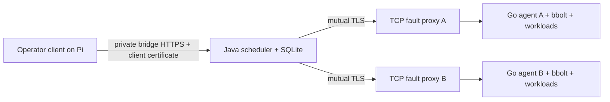

# Native cluster MVP on the Pi

This lab runs a native Java scheduler and two Go process agents in separate ARM64
Docker containers. The native distribution uses SQLite, the shared protocol
validator and Java HTTPS APIs. Its runtime classpath contains no Mesos dependency.
The legacy scheduler remains a separate build.



The scheduler and proxies share an internal control bridge. Each agent shares a
separate internal worker bridge with its own proxy. Proxies forward encrypted
bytes; the scheduler verifies the agent certificate directly. The operator client on the Pi connects to the scheduler’s private bridge address,
with TLS hostname verification fixed to `scheduler`. No host ports are published. Workload HTTP probes
run inside the agent container through a verified Docker creation identity.

## Operate the lab

For a fresh checkout, use the [CUT-01 image build and qualification lane](../../build-support/native/README.md),
which [passed its complete Pi gate](CUT01_STATUS.md).
It packages its own JRE, scheduler libraries and Go executables; the lab needs no
executable bind mounts. The commands below describe the original checkout-tool
lane, which remains supported for the already-running MVP.

Use the checkout toolchains and the previously qualified digest-pinned Debian
ARM64 base image. The runner rebuilds binaries from current source offline,
verifies native Java runtime artifacts, generates private lab certificates and
records source and artifact hashes. It requires Python 3, OpenSSL and Docker.
No Docker socket is mounted into a container.

From this checkout on the Pi:

```sh
sg docker -c 'build-support/lab/clusterctl --run-root "$PWD/.pi-lab/cluster-mvp" up'
sg docker -c 'build-support/lab/clusterctl --run-root "$PWD/.pi-lab/cluster-mvp" demo'
build-support/lab/clusterctl --run-root "$PWD/.pi-lab/cluster-mvp" status
build-support/lab/clusterctl --run-root "$PWD/.pi-lab/cluster-mvp" stop --job mvp-service
sg docker -c 'build-support/lab/clusterctl --run-root "$PWD/.pi-lab/cluster-mvp" down'
```

`up` requires a new run directory. `down` removes only containers and networks
whose creation IDs, labels, mount roots and isolation configuration match the
lab manifest. It preserves database files, certificates, workload logs and
evidence. An ownership mismatch fails cleanup and preserves the uncertain
resource. It never prunes shared Docker images or unrelated containers.

`demo` submits one batch and a two-instance HTTP service. `submit --file JOB.json`
accepts the existing `native-v1alpha1` Job schema. Workloads use explicit argv and
environment and must refer to trusted executables already in the container.
`/opt/aurora/bin/native-workload` is the included batch/HTTP test executable;
`/evidence` is the worker's private writable evidence directory.

To inject a fault, use a verified lab role:

```sh
sg docker -c 'build-support/lab/clusterctl --run-root "$PWD/.pi-lab/cluster-mvp" fault --target proxy-a --action block'
sg docker -c 'build-support/lab/clusterctl --run-root "$PWD/.pi-lab/cluster-mvp" fault --target proxy-a --action unblock'
sg docker -c 'build-support/lab/clusterctl --run-root "$PWD/.pi-lab/cluster-mvp" fault --target scheduler --action crash'
sg docker -c 'build-support/lab/clusterctl --run-root "$PWD/.pi-lab/cluster-mvp" fault --target agent-a --action crash'
```

The keeper restarts the daemon inside the existing container namespace. A proxy
block closes existing connections as well as rejecting new connections. Agent
daemon death kills its trusted workload processes; reopening the same journal
reports lost execution after verified cleanup. Only the scheduler creates a
replacement attempt for a still-desired service instance.

## Durable behavior

Job submission, desired membership, attempts, reservations and immutable outgoing
commands live in SQLite. Dispatch follows commit. Scheduler startup commits a new
epoch before it refreshes agent sessions; retransmission wraps the original
command body in current authority. Agents retain command deduplication and Stop
tombstones even after observation acknowledgements prune their event journal.

Observation reduction and contiguous cursor advancement share a scheduler
transaction. Acknowledgements follow commit. Bounded full agent inventories
support reconnect reconciliation; missing inventory entries never prove process
cleanup. Partitions mark a node unreachable and remove reported readiness while
retaining reservations. Service replacement requires terminal execution and
complete cleanup. Completed batches and cancelled service membership stay
finished across scheduler restarts.

## Qualification

Run the acceptance lane against a fresh running lab before submitting the demo:

```sh
sg docker -c 'build-support/lab/cluster-check --run-root "$PWD/.pi-lab/cluster-mvp" --repeats 3 --mixed-seconds 600'
```

Each round verifies batch idempotency, two-node service placement and physical
HTTP readiness, scheduler crash recovery, partition/Stop/reconnect, agent daemon
crash with one scheduler-owned replacement, forced Stop and exact port release,
and no resurrection after another scheduler restart. Online SQLite backups are
started as actual scheduler daemons on a separate internal restore bridge with
no route to live agents. The final bounded mixed run keeps two service replicas
running while submitting and verifying batches.

The runner writes JSON evidence after each case and records failed cases before
returning an error. Workload evidence records actual launches and signal receipt.
Forced-stop cases also read the authenticated agent's actual wait result, require
signal 9 after TERM receipt and verify that lost execution has no invented exit
code. Before qualification, the runner compares current source/harness hashes
and built artifact hashes with the lab's creation manifest.
The native process and container process lanes remain useful focused regressions:
see [process runtime qualification](PROCESS_RUNTIME_STATUS.md).

## Scope

This is a single-scheduler, two-node development profile with static certificate
enrollment and a bounded inventory (64 jobs of up to 4 KiB, 48 historical attempts).
The state API reports these limits; use a fresh lab directory for another full
qualification run. It does not implement HA, live restore into
an existing cluster, certificate rotation, arbitrary container-loss adoption,
remote workload logs, rolling job updates or production workload isolation.
Lab certificates last seven days; use a fresh lab to reprovision them.

Containers run as the invoking non-root user with a read-only root filesystem,
dropped capabilities and no-new-privileges. They execute trusted, non-detaching
processes. Memory is a scheduling reservation on this Pi, whose memory cgroup is
disabled. Recreating an agent container changes its observed kernel scope and
fails reopening the old runtime journal; use daemon faults for same-scope
recovery tests. State must not be erased or adopted to bypass this check.

Java modernization and broader Mesos removal follow qualification of this native
baseline, as ordered in the [unified roadmap](UNIFIED_AURORA_ROADMAP.md).

## Local validation, 2026-09-10

The orchestrator reviewed delegated changes and ran the focused tests and actual
containers independently. The final test logs are checkout-local, ignored files:

| Check | Executed result |
| --- | --- |
| Native Java | 13 scheduler engine, 14 SQL and 7 protocol tests pass; protocol/JDBC artifact verification passes. `.pi-tools/cluster-parent-java-tests.log` |
| Go | 42 agent/CLI/protocol, 7 workload and 5 helper top-level entries pass, including subprocess-helper entries. Vet passes for all three modules. `.pi-tools/cluster-parent-go-results.json` |
| Lab regressions | 61 Python tests pass, including 16 cluster lifecycle/ownership regressions. `.pi-tools/cluster-parent-python-tests.log` |
| Recovery | Three full rounds pass, including an isolated running restore in each round. Six TERM-resistant service stops report actual signal 9; three lost executions retain a null exit code. |
| Mixed workload | Pass: 600.84 seconds with two service replicas and 20 batches. Each batch launches once; the services retain their original two launches and stop cleanly. |
| Fresh demo | `.pi-lab/cluster-mvp/evidence/demo.json` records one completed batch launch and two physically probed service replicas, one per agent. |

The final acceptance result is
`.pi-lab/cluster-acceptance-final/evidence/c1789054448-result.json` and its progress
log is `.pi-tools/cluster-acceptance-final.log`. The final result has `ok:true`,
23 passing case entries and 40 terminal, cleaned-up attempts. A result with
`ok:false` is not a completed qualification, even when preceding entries passed. The separate
demo cluster uses a fresh database so retained acceptance history does not consume
its attempt budget.

The acceptance containers and networks were removed with verified ownership;
their state and evidence remain. The separate `.pi-lab/cluster-mvp` cluster was
left running. Its `evidence/final-verification.json` records the final source
comparison, healthy nodes, physical HTTP probes and completed acceptance cleanup.
Unrelated Docker resources, including Home Assistant, were preserved.

Local `master`, fork `origin/master` and `upstream/master` were fetched and verified
at `11ebaeeb071cb182c388a40755e84f60dda32260`. Implementation stays on
`codex/standalone-foundations`. These checks do not qualify the complete legacy
Java/frontend suite, production HA or a JVM modernization.
