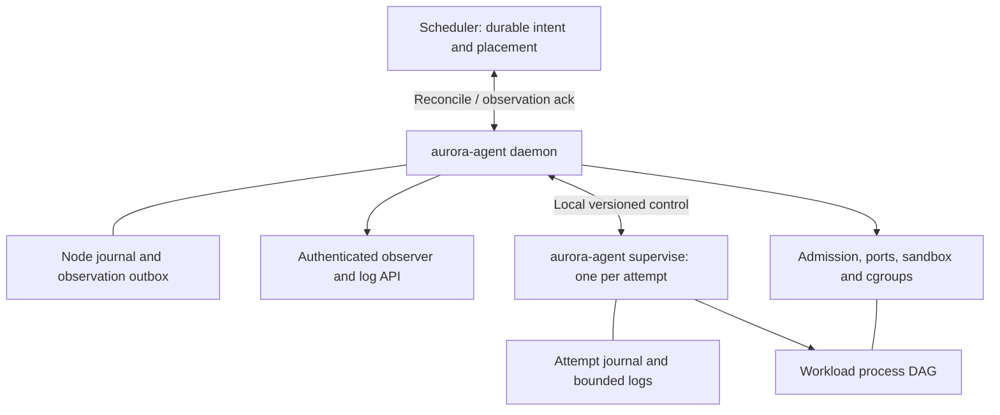

# Go worker agent: replacing Thermos and the Mesos worker boundary

Status: proposed design, grounded in source review; no implementation or runtime validation.
Research date: 2026-09-09/10, America/New_York/UTC.
Baseline: `codex/aurora-context`, commit `e3350f63d446cca17e8f1763ce30cc94346e64cf`.
Report branch: `codex/go-agent-design`.

## Recommendation

Build one versioned `aurora-agent` Go executable providing node admission, task execution,
process planning, local recovery, health, logs, and observer APIs. Remove the Mesos executor
protocol, Python runner PEX, checkpoint-root discovery, and separate observer service.
Keep the scheduler responsible for placement, replica replacement, quotas, updates, and
cluster membership. Do not rebuild Mesos as a general-purpose multi-framework resource broker.

Interpret **one binary as one shipped executable**, with an internal per-task `supervise`
mode when uninterrupted recovery is required. The host daemon can combine executor and
observer responsibilities in one process; a surviving task supervisor preserves child exit
status and log capture across daemon crashes. A literal single OS process is a useful early
MVP, but must drain or terminate tasks on restart and acknowledge that behavior as a break.
Do not claim PID rediscovery alone reproduces Thermos recovery.

Start with Linux host processes, explicit argv/environment, strict manifests, cgroup v2
admission, bounded logs, and conservative disconnect handling. Add the useful Thermos DAG
subset and surviving supervisors before migrating jobs that depend on them. Add OCI execution
through a runtime adapter later; implementing an OCI runtime inside this project is out of scope.

## Evidence, execution environment, and assumptions

All checkout inspection and report writing ran on the requested remote host, verified before
research with `hostname`, `uname`, and Git commands:

| Observation | Value / implication |
| --- | --- |
| Host | `raspberrypi`; `/proc/device-tree/model`: Raspberry Pi 5 Model B Rev 1.0 |
| Architecture / kernel | `aarch64`, `6.18.39+rpt-rpi-2712` |
| Checkout | `/home/jordanly/.codex/worktrees/88f0/aurora`; clean detached HEAD initially at the exact baseline, then isolated branch above |
| Memory snapshot | `free -m`: 8062 MiB total, 5997 MiB available, 2047 MiB swap; transient inventory, not a capacity benchmark |
| cgroup observation | Unified membership `0::/user.slice/user-1000.slice/session-119.scope`; root controllers `cpuset cpu io pids` |
| Material host limitation | `/proc/cmdline` contains `cgroup_disable=memory`; memory controller is absent. This host does not currently demonstrate enforceable per-task RAM limits. |
| Toolchain | `command -v go` returned no path; no Go build was attempted |
| Instructions | Read `AURORA_CONTEXT.md` first; no `AGENTS.md` found in inspected checkout ancestry or relevant repository directories |

The historical host inventory inside `AURORA_CONTEXT.md` describes a different, Darwin host;
it is not the inventory for this task. Local code facts below refer to the baseline, with
relative links usable from this report. External sources are primary documentation consulted
during this review, not proof that a particular dependency or feature runs on this Pi.

**Provisional scheduler assumptions, not agreements with another design task:**

1. One authoritative scheduler cluster persists placements and monotonically increasing
   leadership terms; an authenticated leader can demonstrate current authority. Transport
   identity alone is not a leadership proof.
2. An immutable execution attempt belongs to a logical `(cluster, job, instance)` and exactly
   one agent incarnation. A replacement receives a new attempt ID, even on the same host.
3. The scheduler persists intent before delivery and observations before acknowledging them.
   It retains unresolved placements across its own restart.
4. Agents have stable local storage and exclusive ownership of their managed workload area.
   Losing that storage is a node-incarnation change, not an empty successful recovery.
5. The initial deployment is a trusted Linux worker pool. Running different Unix users and
   setting cgroups does not constitute a complete hostile-tenant isolation boundary.

If these assumptions change, revise the protocol and failure tests before coding placement.

## What exists and what to do with it

The existing launch chain is Java `MesosTaskFactory` → binary Thrift `AssignedTask` inside
Mesos `TaskInfo.data` → Python executor → separate runner PEX → Thermos runner → per-process
coordinators → `/bin/bash -c`. The executor handles one task; the new daemon must handle many.
The embedded executor JSON is a second configuration boundary, and the runner/checkpoint
protocol is a third. See [task factory](../../src/main/java/org/apache/aurora/scheduler/mesos/MesosTaskFactory.java),
[executor](../../src/main/python/apache/aurora/executor/aurora_executor.py),
[task decoding](../../src/main/python/apache/aurora/executor/common/task_info.py), and
[runner wrapper](../../src/main/python/apache/aurora/executor/thermos_task_runner.py).

| Area | Finding at baseline | Decision / tradeoff |
| --- | --- | --- |
| Identity | Job instance, scheduler attempt, Thermos task, process, and process run have different lifetimes. | Retain logical instance → immutable attempt → named process → numbered run. Agent retries runs; scheduler replaces attempts. |
| DAG | `TaskPlanner` expands ordered lists into predecessor edges, rejects invalid dependencies; failed predecessors do not release successors. Dependencies on daemons, and ordinary processes on ephemeral predecessors, are prohibited. | Retain success-dependent DAGs and these restrictions. Specify deterministic name order when concurrency is constrained; old set iteration is not a compatibility guarantee. No distributed workflow graph. |
| Process policy | `daemon` restarts after success as well as failure. `ephemeral` does not hold the task open and normally exhausts failures as finished. `min_duration` is measured **after termination**, despite its name. `max_concurrency=0` is unlimited. | Retain explicit restart and completion policies; rename delay to `restartDelay`. Keep zero/unlimited meanings only in the compatibility profile. Never equate a daemon with an ephemeral sidecar. |
| Retries | Process failure count, task failed-process count, and scheduler attempt replacement count are separate. Lost processes do not consume process failure count but do count toward the total-run safeguard (`sys.maxsize`). | Retain separate counters; persist before a retry. Native policy uses explicit unlimited values and a bounded crash-loop rate. Do not carry an architecture-dependent `sys.maxsize` contract. |
| Task result | Task `max_failures=0` can allow success with failed independent processes; a blocked DAG can still fail. Finalizer failure does not overturn the primary result. | Preserve only in an explicit legacy profile. Native mode requires all required processes to succeed; optional processes are explicit. Keep primary result plus separate finalization result. |
| Finalization | ACTIVE → CLEANING → FINALIZING; cleanup and finalizers share `finalization_wait`. Finalizers can be skipped when the budget expires. | Retain bounded, best-effort finalizers in stage 2. No guarantee after reboot, forced node kill, or exhausted deadline. Reject them in stage 1. |
| Checkpoints | Thrift streams store task phases, process sequences, coordinator PID/fork time, child PID, exit code, configuration/header. Replay suppresses side effects and uses a local control lock. | Retain durable state and exclusive control, replace wire/storage format. No adoption of live Python checkpoints. Preserve historical fixtures for a read-only export tool if later needed. |
| Logs / observer | Process/run stdout/stderr, optional rotation and destinations; observer discovers Mesos directories and presents task/process/config/files. | Retain task/process/run identity, tail and range reads, rotation, terminal retention. One indexed observer API; remove Mesos path scanning and old HTML as an execution dependency. |
| Health | HTTP/shell checks, startup grace and success counts; failure limit uses `>` rather than `>=`. `.healthchecksnooze` treats checks as successful. Aggregate status gates RUNNING. | Separate startup, readiness and liveness. Translate old threshold carefully (`N` tolerated failures becomes `N+1` failing probes). Reject implicit snooze files; use an audited, expiring override that does not fabricate readiness. |
| Resources | Python resource checker fails excess disk usage; CPU/RAM statistics do not enforce limits. Mesos task factory budgets executor overhead and delegates container configuration. | Agent takes enforcement and local admission responsibility. Include daemon reserve and supervisor overhead. Reject unsupported hard limits instead of silently reporting them as enforced. |
| User / environment | Process coordinator switches supplementary groups/GID/UID; environment is deliberately small, with `preserve_env` and `.thermos_profile` escape hatches. | Resolve role to allowlisted numeric UID/GID/groups. Explicit environment and working directory; no inherited daemon secrets, profile sourcing, or automatic account creation. Root workloads require a separate explicit policy. |
| Signals / lifecycle | HTTP shutdown endpoints precede runner termination; cleanup escalates signals and handles process groups/coordinator loss. | Retain optional HTTP hook, TERM then KILL, under one immutable stop deadline. Record cause separately from process exit. Persist stop intent before delivery. |
| Containers | Mesos and Docker paths exist; Docker without executor config can bypass Thermos. | Host process MVP; later digest-pinned OCI image path. Reject AppC, custom Mesos executors, Docker-specific options and arbitrary volume modes until explicitly mapped. |
| Ports | Scheduler assigns named ports; executor resolves aliases and runtime bindings. | Retain named allocations, now atomically reserved by agent on admission. Explicit protocol/address families; return assignment before launch. Stop probing/reallocating on retries within an attempt. |
| Discovery | Optional ZooKeeper ServerSet registration starts independently of the health checker reaching RUNNING and rejoins after session expiry. | Deliberately change to readiness-gated, expiring endpoints. Scheduler-owned discovery projection; no direct worker ZooKeeper dependency. |
| Upgrades | Runner and agent recovery are distinct; local checkpoint recovery alone does not establish complete Mesos crash recovery. | Drain-and-replace initially. Later reconnect daemon to surviving same-binary supervisors with negotiated local protocol/schema versions. |

Sources for this table: [planner](../../src/main/python/apache/thermos/common/planner.py),
[schema/defaults](../../src/main/python/apache/thermos/config/schema_base.py),
[runner](../../src/main/python/apache/thermos/core/runner.py),
[process/coordinator](../../src/main/python/apache/thermos/core/process.py),
[checkpoint schema](../../api/src/main/thrift/org/apache/thermos/thermos_internal.thrift),
[health checker](../../src/main/python/apache/aurora/executor/common/health_checker.py),
[status aggregation](../../src/main/python/apache/aurora/executor/common/status_checker.py),
[resources](../../src/main/python/apache/aurora/executor/common/resource_manager.py),
[announcer](../../src/main/python/apache/aurora/executor/common/announcer.py),
[HTTP lifecycle](../../src/main/python/apache/aurora/executor/http_lifecycle.py), and
[observer file API](../../src/main/python/apache/thermos/observer/http/file_browser.py).
The scheduler retry distinction is documented in the source-grounded
[context](../../AURORA_CONTEXT.md#task-transitions-status-acknowledgements-and-partitions): services
ignore the ordinary `maxTaskFailures` cap. A migration must not accidentally impose that cap.

### Mesos-agent responsibilities that must receive an owner

Removing `launchTask` does not remove resource accounting or node recovery. Allocate ownership
explicitly:

| Responsibility | Proposed owner / minimum behavior |
| --- | --- |
| Capacity and attributes | Agent advertises configured capacity, architecture, enforced controllers and runtime capabilities; scheduler selects placement; agent rechecks atomically. CPU/RAM telemetry is not reservable capacity. |
| Resource offers | Remove offer lifecycle. Scheduler sends a placement intent; agent accepts or rejects against its durable reservation ledger. One launch rejection releases the scheduler's reservation only after reconciliation. |
| Artifacts / sandbox | Agent stages content with digest verification, size/time limits and path-safe extraction before execution. Stage 1 uses preinstalled artifacts only. No legacy Mesos fetcher executable. |
| Process/container lifecycle | Agent creates sandbox, applies credentials/limits, starts, observes, stops and cleans up. External OCI runtime implements container mechanics later. |
| Reliable status / recovery | Agent local journal and durable observation outbox; scheduler durable acknowledgements and reconciliation. No dependence on Mesos reliable status delivery. |
| Usage, disk pressure, GC | Agent samples resource usage, rejects new starts under pressure, rotates logs and removes eligible terminal sandboxes. Keep unacknowledged terminal metadata even if logs expire. Never GC active tasks or unresolved reservations. |
| Maintenance / upgrades | Scheduler sequences host drain and replacement; agent marks admission disabled and supplies stop/empty confirmations. |
| Network / persistent storage | Host networking and ephemeral sandbox initially. Defer overlay networks, persistent volume attachment/fencing, GPUs, revocable resources and resource oversubscription; reject those features. |

Mesos documents recovery of checkpointed executors and unacknowledged status across agent
restart, plus systemd lifecycle considerations. This is a useful requirements comparison,
not proof that this checkout enables every mode. [Mesos agent recovery](https://mesos.apache.org/documentation/latest/agent-recovery/).

## Runtime and recovery architecture



The supervisor owns the attempt's planner, child reaping, run journal, stop deadline and log
writers. The daemon owns node admission, scheduler delivery, host metrics and read APIs.
Supervisors persist while the daemon restarts; their local events have `(attemptId, seq)` so
reimport into the node outbox is idempotent. A supervisor receives an immutable resolved spec,
not arbitrary remote commands. Protect its Unix socket by directory ownership and peer
credentials; identify it with attempt, boot ID and a persisted supervisor identity.

Why keep this boundary: Linux wait operations obtain status for children; pidfds support
stable process references but do not grant a new daemon waitable parentage. A process may
exit and be reaped while that daemon is down. Therefore a recovered PID is insufficient to
declare success or safely release DAG successors. [Linux wait](https://man7.org/linux/man-pages/man2/waitpid.2.html),
[pidfd_open](https://man7.org/linux/man-pages/man2/pidfd_open.2.html).
This is the design inference motivating surviving supervisors, not a claim of seamless recovery
from their own destruction.

Use Go's supported process launch APIs; do not port arbitrary Python post-fork execution
into a multithreaded Go process. Launch the same executable in a constrained child mode for
setup when necessary. `os/exec` does not invoke a shell automatically, so argv execution and
explicit `/bin/bash -c` legacy execution can remain distinct. Give each child exactly one
wait owner; avoid mixing a wildcard reaper with competing `Cmd.Wait` calls.
[Go os/exec documentation](https://pkg.go.dev/os/exec).

### Durable local state and launch ordering

Propose a small versioned append journal with framed records, checksums, monotonically
increasing sequence numbers and fsync boundaries; atomic snapshot replacement includes
directory synchronization. Keep this behind `journal.Store` so a transactional embedded
database can replace it if fault testing exposes excessive complexity. Do not implement a
general database. Observer caches and metrics are rebuildable; intent and outcomes are not.

Persist node identity/incarnation, accepted leader term, reservations, accepted commands,
immutable specs/hashes, stop tombstones and outbox cursor. Attempt records include process
run counters, dependency outcomes, timers, PID/start identity, boot ID, cgroup identity,
exit/signal facts, primary result and finalizer result. Workload credentials cannot modify
control journals; sandbox ownership is separate from state ownership.

Launch transaction:

1. Validate authority, expected incarnation, schema/capabilities, immutable spec, UID policy,
   DAG, capacity and port availability. Serialize admission across concurrent requests.
2. Persist accepted intent and all reservations together, then acknowledge `Accepted`.
3. Prepare sandbox/cgroups/logs; persist `Prepared` and run launch intent before user code.
4. Start supervisor/child through a gate: create stable identity and cgroup membership before
   releasing user execution; journal launch outcome. Never release an uncontained child.
5. Persist observed transitions and emit replayable events. An acknowledgement means durable
   acceptance or durable observation, never that an HTTP response establishes execution.

There remains an unavoidable crash window between an external process action and its durable
record. Recover by querying the known supervisor and cgroup. If evidence is ambiguous, stop
and prove the cgroup empty, report `Lost/OutcomeUnknown`, and ask the scheduler for a new
attempt. Never rerun a possibly executed batch command under the same run ID. Application
side effects require application idempotency keys; the agent cannot offer exactly-once execution.

A partial trailing journal record may be discarded only with a tested framing rule. Interior
corruption, fsync failure, missing state, or incompatible schema disables admission and
quarantines unresolved workloads. Preserve evidence; do not initialize an empty state root
over an existing managed cgroup tree. WAL compaction cannot discard unacknowledged observations
or stop tombstones. Require a durable scheduler `Forget` barrier after terminal acknowledgement
before collecting the attempt's control metadata.

### Explicit failure behavior

| Event | Required behavior |
| --- | --- |
| Scheduler connection lost | Continue already accepted attempts and their bounded local retries/finalizers. Accept no new remote intent without authority. Expire externally published readiness. Scheduler marks reachability unknown and retains reservation/placement. |
| Scheduler restarts | Restore desired attempts, leadership term and observation cursor; reconcile inventory before issuing replacements. Lost reply means retry the same intent, not invent another attempt. |
| Daemon crash, supervisor survives | Supervisor continues from accepted intent; daemon acquires exclusive node lock, verifies boot/supervisor identities, imports events, rebuilds reservations, then enables admission. Health readiness starts unknown until fresh evidence. |
| Supervisor crash | Exit outcomes may be missing. Daemon kills remaining attempt cgroup, waits for emptiness and reports lost outcome. No blind child adoption or process retry. |
| Stage-1 single-process crash | Recovered agent stops every unresolved managed attempt, proves empty, then reports lost. Planned upgrade drains beforehand. State this limitation in the advertised capabilities. |
| Host reboot | Boot ID changes; previous PIDs are invalid. Report active old attempts lost, retain logs/tombstones, and wait for scheduler-issued new attempts. Do not resume an old batch graph after reboot. |
| Stop while disconnected | Scheduler persists stop intent; delivery may wait for reconnection. Agent that already received stop completes it locally and never returns to run. A local authorized emergency stop also creates durable intent and an observation. |
| Stop with blocked/uninterruptible child | Report `Stopping`, escalation status and nonempty cgroup; do not claim terminal cleanup or release resources merely because a deadline elapsed. |
| Disk full / outbox pressure | Reserve emergency journal space; stop new admission before exhaustion. Metrics may be dropped, lifecycle records may not. If control durability is lost, fail closed and expose node failure; do not acknowledge writes. |
| Lost node storage / conflicting node identity | Quarantine and reconcile externally; use a new incarnation only after old workloads are stopped/fenced. Do not use hostname as proof of identity. |

Default replacement policy is **wait for confirmed stop or external fencing**. A network timeout
does not establish that a remote process is dead. An explicit availability-first job policy
may permit overlapping attempts, but must advertise that risk and is deferred from MVP.
Execution leases with local expiry may later bound disconnected operation; they still need
clock/pause assumptions and do not prove a stuck kernel or external side effect has stopped.
Applications needing exclusive writers need a resource-level fencing token or equivalent.

## Minimal scheduler–agent contract

Use versioned JSON over mutually authenticated HTTPS for the first protocol, with the agent
initiating a bounded long-poll `Reconcile` exchange to configured scheduler endpoints. Define
wire types independently of transport so streaming/protobuf can follow without changing state
semantics. Cap messages, pagination, timeouts and outstanding observations. No arbitrary remote
shell, Mesos offers, or opaque executable Python payload in this interface.

| Message / object | Required content and semantics |
| --- | --- |
| `Hello` | cluster ID, stable node ID, incarnation, boot ID, agent/local-schema versions, supported protocol range, architecture, capacity/reserved usage, attributes and tested capabilities; scheduler returns term, session ID and authority proof |
| `Reconcile` request | session/term, durable applied-intent revision, observation batch and cursor, inventory snapshot ID/pages, current admission/pressure status |
| `Reconcile` response | durable observation acknowledgement, desired-intent batch, explicit snapshot completeness marker, term/authority renewal; no implicit kill from a missing page |
| `RunAttempt` | unique attempt ID, logical job/instance, expected incarnation, command ID, desired revision, immutable template digest, resolved execution spec, resource request, named-port request, required capabilities |
| `StopAttempt` | attempt/incarnation, command ID/revision, cause, bounded grace; creates permanent stop tombstone for this attempt. Repeated stops can shorten, never extend, its persisted deadline. |
| `SetAdmission` | node revision and `Ready` or `Draining`; draining rejects launches, but does not silently kill existing attempts |
| `ForgetAttempt` | attempt/incarnation plus terminal observation acknowledgement and explicit durable deletion barrier; releases metadata retention, not a running process |
| `AttemptObserved` | attempt/incarnation, sequence/event ID, applied desired revision, spec digest, phase, readiness/reason, process/run outcomes, assigned ports, reserved resources, timestamps and cleanup confirmation |
| `NodeObserved` | capacity generation, pressure, reachability session, capability changes, reservations; resource samples have timestamps and may be coalesced |

Desired attempt state is `Run` or `Stop`; `Run` means execute this attempt once, not keep
recreating it after terminal completion. Spec mutation requires a new attempt. Native observed
phases are `Accepted → Preparing → Starting → Running → Stopping → Terminal`, with direct
failure/completion paths from intermediate phases. `Terminal` carries outcome `Succeeded`,
`Failed`, `Killed`, or `Lost`, a reason and `cleanupComplete`. Capacity releases only after
cleanup is confirmed; unknown physical state remains reserved. Readiness is a separate
`Unknown/NotReady/Ready` condition. Scheduler `Unreachable` is not an agent process outcome.

Protocol invariants:

- Persist the highest accepted term and reject older terms. A higher term must be authenticated
  with the assumed authority mechanism; on first release a single configured scheduler may
  satisfy this operationally, but that is not an HA solution. A stale leader isolated with an
  agent cannot be fenced merely by a term the agent has never seen.
- Dedupe by attempt and command identity. Same ID with another payload is an error. Lower
  desired revisions cannot overwrite later ones; stop wins permanently even over later `Run`.
  A stop arriving before run records a tombstone and suppresses the delayed launch.
- Agent persists before accepting a command. Scheduler persists before acknowledging an event.
  Replayed observations are harmless; a decreasing sequence cannot restore old readiness or
  reverse a terminal outcome. Record terminal cause precedence deterministically.
- Inventory reconciliation uses complete, revisioned snapshots. Missing, unknown and explicitly
  stopped attempts are different. Unknown managed attempts are quarantined and explicitly
  stopped after comparison, never opportunistically adopted as a new placement.
- Scheduler-level exclusivity prevents two placements for one instance; agent exclusivity
  prevents duplicate starts locally. Neither alone proves cross-host physical exclusivity.
- Authenticate node identity and authorize cluster membership; authorize observer reads by
  job ownership. Rotate certificates with overlap, bound session age, redact credentials from
  event/log metadata, and audit administrative stop/drain operations.

Suggested initial timing, to be validated rather than treated as reliability guarantees:
heartbeat every 5 seconds, scheduler marks unreachable after 3 missed intervals, observation
delivery retries with capped jitter, 30-second default stop budget. No automatic replacement
at the heartbeat timeout. Discovery expiry must be tied to fresh readiness and session
liveness, not merely the last persisted `Running` event.

## Execution details that should not remain implicit

**Resources and cgroups.** Reserve host overhead first, then task CPU/memory/disk/ports and
supervisor overhead. For cgroup v2 use a delegated subtree, process-free internal nodes and
separate management/workload leaves. Configure CPU quota/weight, memory/swap policy and PID
limits; monitor OOM events and pressure. `cgroup.kill` provides subtree SIGKILL and
`cgroup.events` reports population. Disk capacity enforcement needs sandbox accounting or
filesystem quotas; IO throttling is not a disk-size quota.
[Kernel cgroup v2 documentation](https://docs.kernel.org/admin-guide/cgroup-v2.html).

For surviving supervisors, place each attempt in its own systemd-managed lifetime boundary
with delegation, separate from the daemon service; management and payload leaves sit inside
the attempt boundary. Restarting the daemon must not stop those units. Explicit attempt stop
still terminates the entire attempt. systemd documents delegated ownership and controller
availability; do not manipulate arbitrary systemd-owned cgroups or assume `Delegate=` makes
an unavailable controller appear. [systemd delegation](https://systemd.io/CGROUP_DELEGATION/).
Treat the exact unit integration as a mandatory stage-3 test, not a verified configuration here.

**Credentials and signals.** Keep privilege changes in child setup. Clear supplementary groups
before applying the configured set, set GID/UID, restrict capabilities and file descriptors,
and verify sandbox ownership. Run health and shutdown commands with workload credentials and
limits. TERM the process group; on expiry kill the full attempt subtree, including descendants
that changed sessions. Finalizers use the remaining stop allocation, and must finish before
capacity release. Record signal versus exit code without inventing success for missing status.

**Logs and observation.** Stable log identity is `(attempt, process, run, stream, segment)`.
Cursor reads include segment and offset so rotation cannot silently change the meaning of a
byte offset. Default bounded local retention; let a separate collector ship logs. Give log
ingestion an explicit overload policy (bounded buffering plus visible dropped-byte counters,
or configured workload backpressure); never let an unbounded log queue consume control memory.
Protect control records from log exhaustion. Observer views include spec digest/redacted config,
state/reasons, per-run exit history, resource usage, health and log retention status. Avoid
unrestricted sandbox browsing initially; a later file API must reject traversal and symlink
escape. Old `/task/:id` can be a redirect, not a preserved unauthenticated API contract.

**Health and discovery.** Startup has a finite deadline, readiness controls endpoints, liveness
may terminate the attempt. No-check jobs become ready after required startup conditions.
Checks have timeouts, bounded output/concurrency and a failure reason; exec checks share the
workload sandbox/security context. Daemon restart invalidates cached readiness until refreshed.
The scheduler publishes a leased endpoint view containing attempt and port identity; consumers
must honor expiry. Remove endpoints before graceful stop, with a bounded propagation wait
inside the stop deadline. This intentionally changes old early ServerSet registration.

**Ports and containers.** Atomically allocate named ports from a configured pool excluded from
host ephemeral allocation by deployment policy. A bind check is diagnostic, not a permanent
reservation against unrelated host processes; a later socket-handoff mode can close that race
for compatible applications. Bind collision causes preparation/start failure. Keep allocations
until the attempt cgroup is empty. Host networking first; define TCP/UDP and IPv4/IPv6 explicitly.
For OCI later, use a tested runtime for create/start/state/kill/delete, image digest resolution,
namespace/mount setup and rollback. OCI specifies lifecycle/state operations; it does not by
itself supply image pulling, log retention, or this agent's durable task semantics.
[OCI runtime lifecycle](https://raw.githubusercontent.com/opencontainers/runtime-spec/main/runtime.md).

## Migration away from executable Python

Use strict, versioned JSON as the canonical accepted manifest and wire representation. A CLI
may accept a restricted YAML front end later, rejecting duplicate keys, unknown fields and
implicit coercions. No imports, code execution, environment reads, implicit profiles or
unbounded template language on the scheduler/agent. Teams may generate manifests in their
own build tools, but only resolved data crosses this boundary.

Keep job/update policy outside the execution template hash. Existing conversion already drops
`instances` and `update_config` from the default executor payload; preserve that useful
property so changing replicas or rollout policy does not replace identical tasks.
[Current conversion](../../src/main/python/apache/aurora/config/thrift.py),
[executable loader](../../src/main/python/apache/aurora/config/loader.py).

Illustrative **proposed** stage-2 manifest (schema not implemented):

```json
{
  "apiVersion": "aurora/v1alpha1",
  "kind": "Job",
  "metadata": {"role": "web", "environment": "test", "name": "hello"},
  "replicas": 2,
  "replacementPolicy": {"mode": "service", "disconnect": "waitForStop"},
  "template": {
    "semantics": "native-v1",
    "runAs": {"user": "web"},
    "resources": {"cpuMillis": 250, "memoryBytes": 134217728, "diskBytes": 268435456},
    "ports": [{"name": "http", "protocol": "tcp", "family": "ipv4"}],
    "maxConcurrency": 2,
    "processes": [
      {"name": "prepare", "argv": ["/opt/hello/prepare"], "restart": {"mode": "never"}},
      {"name": "serve", "argv": ["/opt/hello/server"], "afterSuccess": ["prepare"],
       "env": {"PORT": {"portRef": "http"}},
       "restart": {"mode": "always", "maxFailedRuns": 3, "restartDelay": "5s"}}
    ],
    "health": {"readiness": {"http": {"portRef": "http", "path": "/ready"}, "timeout": "1s"}},
    "stop": {"grace": "30s"}
  }
}
```

Normalize integer units and explicit duration strings, default fields before hashing, reject
unknown versions, and resolve only typed references (`portRef`, instance, task identity) at
assignment. Never interpolate an untrusted value into shell syntax automatically. Keep both
the unresolved template digest and resolved assignment digest for audit; ports/instance values
must not make each replica look like a different job template.

Migration steps:

1. Inventory trusted `.aurora` configurations and features. Use the existing client only in
   an isolated, explicitly trusted offline exporter to evaluate Python and emit intermediate
   JSON, bindings, defaults and source digests. Prefer already exported JSON when available.
   Arbitrary Python cannot be statically translated with guaranteed equivalence.
2. Convert data into the versioned schema; produce field-level retained/changed/rejected output.
   Keep shell commands as explicit `argv: ["/bin/bash", "-c", "..."]`; do not tokenize shell
   text into argv. Preserve effective environment and user intent explicitly.
3. Translate `Process.max_failures` into failed-run limits, with zero → explicit unlimited,
   and `daemon` into restart-after-success behavior. Translate `ephemeral` to completion-optional
   behavior and preserve its failure effect only in `thermos-v1` semantics. Translate task
   failure tolerance independently. Use fixed post-exit delay for legacy `min_duration`.
4. Preserve legacy health attempt-count grace/failure semantics through a compatibility adapter
   or emit a deliberate-change finding. Do not label a time-based native startup deadline as
   exact old behavior. Flag snooze/profile use, custom executors, container options, GPU,
   discovery consumers, finalizers and partition replacement policy for manual decisions.
5. Run rendered-spec and behavioral comparisons. Deploy converted jobs to a separate worker
   pool; replace whole attempts through the scheduler. Never have Python and Go supervise the
   same live task or mutate the same checkpoint root.
6. Roll back by draining Go attempts and scheduling the retained old job definition onto old
   workers. Keep old logs readable until retention expires. Stop shipping the exporter after
   migration; no perpetual Python dependency in the Go deployment.

`thermos-v1` is a finite, documented compatibility profile, not a promise to execute all
Pystachio behavior. Stage-1 rejects unsupported features before acceptance. Keep a release
matrix of accepted schema versions/features so clients can validate against actual agent
capabilities before a rollout.

## Go package structure

| Package / command | Responsibility and test seam |
| --- | --- |
| `cmd/aurora-agent` | `serve`, internal `supervise`/child setup, `validate`, `inspect`, `version`; wiring only |
| `internal/spec` | Strict decoding, normalization, DAG validation, units, typed runtime refs and digests |
| `internal/protocol` | Versioned wire structs, session/term validation, dedupe and fake scheduler transport |
| `internal/agent` | Node reconciliation loop, durable admission ledger, drain and inventory |
| `internal/task` | Pure planner/state reducer, run/retry/finalizer semantics; injected clock and effects |
| `internal/supervisor` | Child ownership, exit collection, local control protocol, event import |
| `internal/journal` | Framing, fsync/snapshot protocol, replay, corruption behavior and outbox |
| `internal/runtime` | Narrow `Prepare/Start/Inspect/Signal/Wait/Cleanup` interface; Linux process backend first, OCI adapter later |
| `internal/isolation` | Linux-only cgroup/credential capability probes and resource enforcement |
| `internal/sandbox`, `ports`, `logs` | Safe paths/staging/GC, atomic named reservations, bounded capture and cursor reads |
| `internal/health`, `observer` | Probe reducers and authorized read API/metrics; no process lifecycle ownership in handlers |
| `internal/testkit` | Fake clock, scheduler, runtime and crash/fault injection; contract fixtures shared with scheduler |

One event loop per attempt serializes lifecycle decisions; bounded node admission serializes
resource ownership. IO runs outside those loops and returns tagged completions so stale results
cannot mutate a new run. Cancellation is an intent, not evidence that a child exited. Keep
protocol and planner types free of Mesos/Thrift/Pystachio dependencies. No general plugin system
or custom executor API in the first release.

## Staged implementation and exit criteria

These are ordered implementation slices, not calendar estimates or work already performed.

| Stage | Scope | Exit criteria |
| --- | --- | --- |
| 0: contract and replay model | Schema, identities, protocol reducer, local journal, fake scheduler and legacy behavior fixtures | Duplicate/reordered commands, stop-before-run, old terms and replay cannot produce duplicate starts or revive stopped attempts; spec normalization is deterministic |
| 1: usable single-process MVP | One process per attempt, many attempts per node; preinstalled programs; explicit UID/env; resources/ports/logs; HTTP readiness; observer; no live restart recovery | Launch/stop/cleanup on native ARM64; resource rejection and bounded disk/log tests pass; restart terminates unresolved attempts and reports lost; scheduler integration exercises disconnect without duplicate replacement |
| 2: Thermos subset | Success DAGs, concurrency, retries, daemon/ephemeral compatibility, finalizers, exec health/HTTP lifecycle, offline config conversion | Retained legacy fixtures agree; deliberate breaks have expected outputs; fault during retry/finalization cannot reset counters or extend stop indefinitely |
| 3: surviving supervision | Same-binary supervisor, separate lifetime units, daemon reattachment, compatible upgrade path and durable event outbox | Kill/restart daemon while children exit and log; recover exact recorded outcomes without restarting children; supervisor loss reports unknown outcome; N/N-1 protocol/schema tests and downgrade refusal pass |
| 4: OCI and migration pilot | Digest-pinned images, restricted volumes, runtime adapter, discovery bridge if required, controlled production canaries | Native ARM64 image and failure cleanup tests pass; migration/rollback exercised with real workload owners; no live Python checkpoint adoption |

A release with stage 1 only must call itself the process-agent MVP, not a Thermos-compatible
replacement. Stop adding features when the selected migration workload cohort is covered.

### Compatibility and fault-validation plan

Use baseline tests as executable specifications when a reproducible Python environment becomes
available; do not rebuild the entire old cluster merely to start the Go planner. Extract
small language-neutral input/event/output fixtures by source review first, label these
source-derived, and later verify them against the old runner. Compare partial order, outcomes,
retry counts and bounded durations rather than nondeterministic ordering of concurrent events.

| Validation | Baseline anchor / acceptance condition |
| --- | --- |
| Graph / retries | [test_task_planner.py](../../src/test/python/apache/thermos/common/test_task_planner.py): cycles/illegal predecessors, failed predecessor blocking, daemon success restart, ephemeral completion, post-exit delay, lost accounting and run guard |
| Failure tolerance | [test_failure_limit.py](../../src/test/python/apache/thermos/core/test_failure_limit.py): blocked successor fails the task; unlimited task tolerance can succeed despite independent failed processes in legacy mode |
| Finalizers | [test_finalization.py](../../src/test/python/apache/thermos/core/test_finalization.py): ordered finalizers, failure does not rewrite primary outcome, finalization after main failure |
| Signals / orphan cleanup | [test_staged_kill.py](../../src/test/python/apache/thermos/core/test_staged_kill.py): coordinator/process death, escalation wait and process-group termination; add descendants that call setsid and ignore TERM |
| Actual launch behavior | [test_runner_integration.py](../../src/test/python/apache/thermos/core/test_runner_integration.py): port/env expansion and process order; add UID/group and secret-environment exclusion cases |
| Recovery | [test_failing_runner.py](../../src/test/python/apache/thermos/core/test_failing_runner.py), [test_angry.py](../../src/test/python/apache/thermos/core/test_angry.py): use as fault-scenario references, not evidence that new journal format is compatible |
| Health / executor aggregation | [executor tests](../../src/test/python/apache/aurora/executor/): readiness gate, tolerated-failure off-by-one, startup deadline, terminal precedence and shutdown cause; explicit divergent fixture for snooze/discovery |
| Protocol | Fake scheduler drops replies/acks, duplicates/reorders batches, sends partial snapshots, changes term and restarts; assert at most one local live run per identity, persistent stop, no terminal regression, no overreservation |
| Durability | Inject kill/power loss before/after every journal fsync and launch gate; truncate trailing record, corrupt middle, fill disk and restore old snapshot; no false success, no acknowledged intent loss, safe quarantine on ambiguous execution |
| Isolation / ports / logs | CPU throttling, memory OOM, PID exhaustion, unavailable controller rejection, address/protocol collision, log flood/rotation, slow observer, traversal and symlink escape; no resource release while descendants remain |
| Upgrade | Drain MVP; later daemon-only restart with live jobs, old supervisor/new daemon pairing, schema incompatibility rejection, interrupted binary replacement and rollback |

Run Linux integration tests in a disposable delegated cgroup and sandbox, not this planning
checkout's live session scope. Distinguish ordinary unit tests from privileged node tests.
Power-loss claims require real storage fault experiments, not just graceful process exits.

## Linux ARM64 / Raspberry Pi feasibility

Go documents `linux/arm64` as a supported build target, and its default ARM64 architecture
level is suitable as a conservative starting point. Cross-compilation is useful, but a
successful cross-build is not a launch/isolation/recovery test.
[Go build targets](https://go.dev/doc/install/source#environment).

Recommendation: develop the core in pure Go with Linux-specific code isolated, initially
targeting `GOOS=linux GOARCH=arm64 CGO_ENABLED=0` if the chosen dependencies permit it. Pin and
record an actual supported Go release during implementation; no compiler was installed or
selected here. Run native tests on this Pi and AMD64 CI; avoid claims about old 32-bit Pis or
arbitrary ARM images. Container images and workload binaries must independently support ARM64.

The observed Pi has enough memory to make a bounded prototype plausible, but throughput and
agent overhead remain unmeasured. Start with 10 tasks/20 active processes; propose a 24-hour
soak with repeated process exits, two daemon restarts, one controlled reboot, log flood and
network interruption. Initial measurement goals: idle daemon RSS below 100 MiB, steady idle
CPU below 1% of one core, and no sustained file-descriptor/goroutine growth. Treat these as
targets, measure supervisor overhead separately, and revise capacity from evidence. Record
launch latency and observation lag p50/p95 under load instead of promising a task density.

Before resource-isolated tests on **this host**, remove the disabling memory-controller boot
configuration through the host's normal administration process, reboot in a maintenance
window, and verify `memory` is exposed and delegated. No boot settings were changed here.
Also verify writable delegated cgroups, pidfd/child-setup support, credentials, storage/fsync
behavior, free disk and workload artifact architecture. Run an explicit failed-admission test
while `memory` is unavailable; a scheduling prototype may opt into a clearly marked
unenforced development mode, but that capability cannot satisfy a hard-RAM job request.

Frequent durable writes and logs need a measured storage budget. Recommend evaluating durable
local storage and retention settings appropriate to the intended deployment rather than
assuming the Pi's boot medium tolerates an arbitrary write rate. Local journals preserve
supervision facts, not application data after disk/node loss.

## Open decisions and checks performed

Resolve before stage 1 integration: scheduler authority proof/term source; node enrollment and
observer authorization; exact capacity reservation units; discovery consumer expiry contract;
and ownership of application fencing. Resolve before stage 3: supervisor unit integration,
local schema compatibility window and journal storage implementation after fault testing.
These are bounded interface decisions; the design does not wait on another research task.

Performed: remote host/architecture/model/kernel and exact commit verification; worktree and
instruction inspection; context-first reading; targeted source/test reading; primary external
documentation retrieval; report link/existence and whitespace checks. No Python/Go builds,
runtime tests, dependency installations, cgroup mutations, workload launches, boot changes,
pushes or merges were performed. Git branch creation required the sandbox's metadata-write
approval because the shared Git directory is outside the writable worktree.

Usage control: first weekly reading 4%, subsequent research-phase readings 4%. Task early-stop
bound is 11% shared weekly usage (first reading + seven points), also bounded by the common
50% early-stop threshold. No subagents, resets, credits or automatic resumption were used.
The reading is shared account usage, not a task cost measurement. The final usage call did
not return and was terminated; 4% is the last available reading, not a verified final value.
Per the user's stop rule, no further research or delegation followed. The design report was
already drafted; only artifact validation followed: all local Markdown link targets exist,
the JSON example parses, and `git diff --no-index --check /dev/null` reports no whitespace
errors. The report remains uncommitted on the isolated branch. Remaining work is the staged
implementation/validation above; no runtime compatibility or performance result is claimed.
