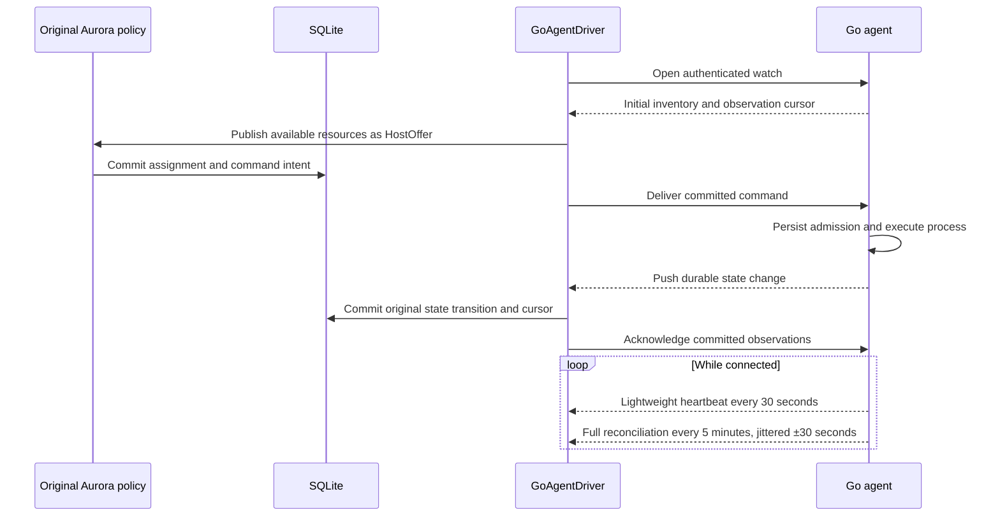

# Push transport, Python retirement and Mesos cleanup

This checkpoint modernizes the original Aurora application in place. Its entry
point remains `org.apache.aurora.scheduler.app.SchedulerMain`; the existing
placement, task state machine, quotas, updater, cron, maintenance, Thrift API and
UI remain the behavior owners. Java 25 and SQLite run the scheduler; Go agents
run the supported process profile. Production multi-scheduler HA is deferred.

The separate scheduler prototype remains abandoned. Public Thrift identifiers
and stored historical records have not been renamed to disguise their history.

## Resource availability and task updates

Each configured agent has an authenticated, persistent mTLS watch connection.
The scheduler opens the connection; the agent sends state changes immediately
over that stream. Idle operation no longer polls full inventory every second.

Heartbeats contain identity/session and cursor information, without rereading
inventory. Durable agent mutations wake the stream; acknowledgements do not
produce a feedback loop. Full snapshots also occur on initial connection and
reconnection. Frames and observation pages are bounded; cursor gaps, changed
authority and inconsistent reservations fail closed.

Signal-terminated processes report `exitCode: -1` in diagnostic inventory. Watch
validation accepts that value only in the execution exit-code field, including
reconnect snapshots. Command canonicalization keeps its nonnegative-number
contract. Rejecting that legitimate diagnostic would otherwise prevent a
committed terminal observation from advancing the original task state machine.

The scheduler merges these observations into its existing state and resource
model. It retains reservations and withdraws offers when an agent cannot be
reconciled. Independent virtual threads and bounded exchanges prevent one
unresponsive agent from holding the global SQLite writer during network I/O.
Command selection and acknowledgement use short transactions on either side of
delivery. The existing local offer-expiry refresh is separate from network
inventory traffic; pending commands retain a bounded retry path.

Host attribute changes invalidate static scheduling vetoes for the affected
offer. A host leaving maintenance can be evaluated again without waiting for
the offer identity to expire; unrelated offers keep their cached vetoes.

Transient supervisor socket failures are retried per attempt while its resource
reservation remains held. Other attempts continue reconciling. Authentication,
protocol and durable-state failures remain errors. Internal daemon failures do
not manufacture Stop intents for unrelated workloads; explicit operator
shutdown still drains them. Detached supervisors support recovery within the
same container namespace.

Transport counters are exported through the original `/vars.json` endpoint:
`go_agent_watch_connections`, `go_agent_watch_snapshots`, `go_agent_watch_deltas`,
`go_agent_watch_heartbeats`, `go_agent_inventory_requests`,
`go_agent_command_requests` and `go_agent_ack_requests`. Connections count opens
cumulatively, rather than currently connected sockets. `/offers` now serializes
neutral offer fields: offer/agent identity, hostname, available resources,
revocable resources, ports, maintenance and unavailability. It no longer needs
a Mesos protobuf JSON module.

## Python and Mesos retirement

The [retirement ledger](inplace08-retirements.json) identifies every removed
tracked file, its previous Git blob and content hash, and its replacement or
retirement reason. It is an audit record, not a coverage exclusion list or a
claim of full Thermos feature equivalence.

All 275 tracked Python files are removed. The maintained client, tool bootstrap,
Thrift entity generator, validation helpers, Docker lab and API acceptance runner
are implemented in Go with small shell launchers. The generator preserves the
original generated Java bytes. Pants, PEX, executable `.aurora` examples, the
Python CLI and Thermos runner/executor/observer are retired, together with their
obsolete Vagrant, Packer and Mesos deployment paths. Unrelated software installed
on the Pi is outside this repository cleanup.

JSON job documents and the [Go client](../reference/go-client.md) provide the
supported submission and operations path through the original `/api` endpoint.
The standalone client needs neither Python nor a Go compiler at runtime. It
rejects duplicate/unknown configuration fields, sends mutations once, checks
original RPC response codes and reports malformed responses as failures.
Arbitrary executable Python configurations do not have an automatic conversion.

Mesos drivers, JNI loading, the replicated-log implementation, executor loaders,
protobuf conversions and runtime dependencies are removed. Neutral fixtures
exercise retained policy behavior; only tests specific to removed implementations
are retired. The scheduler requires Go agent configuration. Mesos/Thermos names
remaining in public Thrift fields, historical fixtures and documentation preserve
wire/storage compatibility; they do not load or contact Mesos. Packaging checks
reject Mesos runtime classes and Python/PEX entries in the original application
jars.

## Recovery and supported execution

The [offline recovery tool](../operations/backup-restore.md) restores a complete
SQLite backup without altering its source bytes, including all seven stores,
outbox, observation receipts and ownership metadata. Historical Thrift snapshot
import uses the original backup reader, loader and backfill in one transaction.
It requires terminal tasks, completed updates and supported cron definitions;
it cannot adopt running Thermos processes. Strict schema validation and exclusive
publication refuse data loss and replacement of an existing database.

The supported executor runs explicit trusted host processes with resource
reservations. It does not implement Thermos process graphs, finalizers, health
checks, service announcement, images, volumes, artifact fetching, named ports,
GPUs or revocable CPU. The user field is metadata, not an OS identity switch.
Memory and disk accounting do not establish cgroup or container isolation.
CPU requests use integer millicores; conversion tolerates only floating-point
representation error, without accepting genuinely fractional millicores.

Agent history remains bounded at 128 attempts and 1,024 command results. Retention
or compaction is needed for indefinite operation. Restart recovery does not
qualify container/namespace-loss adoption, stale-backup adoption, power-loss
recovery, production fencing or multi-scheduler HA. Dependency and UI framework
modernization remain subsequent work in the retained application.

## Qualification

The implementation is published at
[`b5405842b`](https://github.com/jordanly/aurora/commit/b5405842b94cc89219f5ebc548af8fd619711059).
All three [CI jobs](https://github.com/jordanly/aurora/actions/runs/34702901597)
passed for that commit: Go tests/provenance, Java behavior/distribution and Java
quality. The [evidence receipt](inplace08-evidence.json),
[source hashes](inplace08-inputs.json) and [Java suite ledger](inplace08-tests.jsonl)
bind the results to their inputs and artifacts.

| Gate | Result |
| --- | --- |
| Original Java behavior | 1,342 scheduler and 124 commons tests; zero failures, errors or skips |
| Coverage | 91.39% instructions, 80.77% branches; existing 87% / 79% thresholds retained |
| Java quality and packaging | Checkstyle, PMD, SpotBugs, original UI and installed distribution passed |
| UI | 144 tests in 33 suites passed |
| Go agent and tools | Uncached full tests and vet passed for both modules; real supervisor timeout, bind-failure and shutdown regressions passed |
| Fresh cluster smoke | Batch completion, one service per agent, rolling update and clean stops passed |
| Recovery | Three rounds each of scheduler restart, scheduler crash and agent crash preserved task IDs, host placement and workload PIDs |
| Policy | Automatic rollback restored the exact executor configuration; active drain/replacement and manual cron execution passed |
| Mixed workload | 40 distinct batch tasks finished over 600.14 seconds; 136 checks preserved both service identities and PIDs |
| Standalone Go client | 61 commands passed, including updates, restart, scaling, cron, quota and maintenance; cleanup completed without errors |
| SQLite | Read-only integrity check returned `ok`; no pending commands after demo startup |
| Quiet push traffic | 360.004 seconds / 25 samples: 24 heartbeats, two reconciliation snapshots and zero inventory polls, extra commands, acknowledgements, deltas or reconnects |

The fresh `.pi-lab/inplace08-qualified` lab contains the original Java 25
scheduler and two Go agents in separate containers. Two 100mCPU / 32 MiB demo
services remain running as `fixtures/test/push-mvp-demo`, with one per agent.
The quiet measurement ran from 15:55:57 to 16:01:57 UTC on 2026-09-12. Every
health sample passed; task IDs, placement, process IDs/start times and daemon
generations matched at both boundaries. The exact manifest and scheduler
distribution remained unchanged.

Local qualification reused unchanged build outputs; the distribution's
`build.properties` records the preceding commit and dirty working tree from its
build. Source and artifact hashes establish the tested inputs, while CI checks
the committed implementation independently. The earlier failed smoke and soak
runs remain diagnostic evidence, alongside their fixes; they do not count as
successful qualification. In particular, the task that timed out before the
signal fix retains its original LOST history even though its update recovered.

Earlier [INPLACE-05–07 evidence](INPLACE05_07_IMPLEMENTATION_STATUS.md) remains
unchanged and establishes only its named source and artifact versions. The old
temporary INPLACE-08 test containers were removed with their files retained;
the original qualified lab and unrelated Pi applications were preserved.
