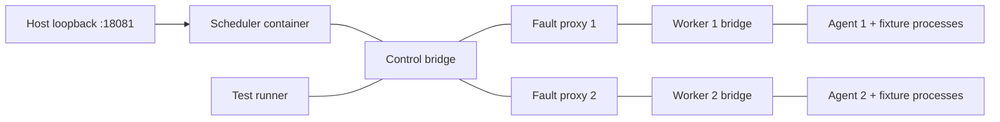

**Raspberry Pi container lab: design and acceptance plan**

Updated 2026-09-10; companion to the [unified roadmap](UNIFIED_AURORA_ROADMAP.md). The target is one Java scheduler and two Go agents in separate Docker containers, with real fixture processes inside each agent container. No nested Docker or Kubernetes is required for this first runtime.

The [Compose blueprint](lab/compose.blueprint.yaml) is a syntax-checkable design. Its Aurora images, configuration schemas, probe tools and lifetime keeper are proposed implementation contracts. They do not exist in the application yet. Parsing the file is not a successful image build or cluster launch.

The implementation provides [labctl](../../build-support/lab/README.md) preflight, private run initialization, rendering and inspection. Its blueprint configurations remain explicitly unconfigured; full-cluster launch and destruction are unavailable. A separate `native-smoke` lane now executes one Java durable-store check and two Go admission checks in actual ARM64 containers, verifies retained state after recreation, and tears down its owned resources. The newer `process-smoke` and `process-container-smoke` lanes exercise real batch/service execution and cleanup. See the [process runtime status](PROCESS_RUNTIME_STATUS.md) for current results and remaining cluster integration work.

**Fresh host evidence**

An independent subagent repeated read-only probes during planning. After the user authorized fixing Docker access, the orchestrator repeated `docker info` and the lab preflight outside the sandbox using the new group membership.

| Observation | Result and implication |
| --- | --- |
| Architecture/kernel | `aarch64`, `6.18.39+rpt-rpi-2712`; Linux page size 16,384 bytes. Native dependencies must execute on this exact environment. |
| Docker client | 29.8.0 executes; Compose v5.5.1 executes. |
| Docker daemon | Access now verified as `jordanly`: server 29.8.0, aarch64, systemd cgroup driver, cgroup v2. Native container execution and storage/runtime qualification remain separate gates. |
| Cgroups | v2; root controllers `cpuset cpu io pids`. Memory is unavailable; boot command line includes `cgroup_disable=memory`. |
| RAM/storage snapshot | 8,062 MiB RAM, about 5,977 MiB available, no swap used, approximately 95 GiB free on checkout filesystem. These are transient observations. |
| Host tools | Java/Javac/Go remain absent from the host PATH. Checkout-local, checksum-pinned Java 8, Gradle, Thrift and Go now execute natively; API/scheduler compilation and focused tests pass. See [build recovery](../../build-support/java/README.md). |
| Rootless prerequisites | No matching subordinate UID/GID allocation found; mapping helpers/rootless setup absent from PATH. Rootless is an option requiring setup, not a demonstrated fix. |

The initial denial was confirmed against the actual host socket, owned by root:docker with mode 0660. At the user's explicit request, `jordanly` was added to the `docker` group; `sg docker -c 'build-support/lab/labctl preflight --require-docker'` now passes outside the sandbox. Existing sessions need a fresh login or `sg docker` to activate membership. Socket permissions, services, boot settings and packages were unchanged.

**Topology**



Three Aurora containers provide the requested scheduler/two-agent topology. Two small TCP proxy helpers provide independent failure boundaries; an optional test-runner drives scenarios. All bridges are project-specific and internal. Scheduler/runner connect only to control; each agent only to its worker network; its proxy connects to both. Runtime tests must verify direct bypass to the scheduler is unavailable. Docker service discovery and bridge isolation support this design, but configuration alone is not proof. [Compose networking](https://docs.docker.com/compose/how-tos/networking/), [bridge networks](https://docs.docker.com/engine/network/drivers/bridge/)

| Path | Proposed routing |
| --- | --- |
| Browser/host | `127.0.0.1:18081` → scheduler HTTP/console `8081`. No agent API or proxy-management host publication. |
| Agent reconciliation | Each worker network resolves `scheduler.lab` to its proxy; TCP `19090` forwards to `scheduler:19090`. |
| Agent evidence/logs | Control network resolves `agent-1.lab`/`agent-2.lab` to the respective proxy; TCP `19100` forwards to that agent's authenticated API. |
| Fixture service probes | Proxy forwards assigned fixture ports into its worker network. Fixtures bind the container interface so these probes can reach them. |
| Fault management | Runner reaches each proxy's management API on control. Host harness invokes only project-scoped Compose operations for container/process faults. |

Use pinned Toxiproxy or another established transparent TCP proxy, verifying its ARM64 artifact before selection. Keep mTLS end to end: scheduler certificate SANs cover `scheduler.lab` for worker-side proxies and `scheduler` for the control-network runner; agent SANs match their enrolled logical names. Local probes use an explicitly verified TLS server name or a certificate SAN covering their actual endpoint. Never disable verification. Certificates authenticate peers; accepted cluster/recovery epochs and protocol authorization establish command authority. Proxies forward encrypted bytes without holding workload credentials. [Toxiproxy upstream](https://github.com/Shopify/toxiproxy)

Proxy timeouts/resets model transport failure. Duplicate requests, stop reordering and lost application acknowledgements require protocol-level test hooks or controlled retries; duplicating TLS bytes is not a valid duplicate-command test. To model full node disconnection, interrupt both reconciliation and evidence/fixture routes. A one-direction stream failure must be labeled as such.

**Container and artifact contract**

| Image | Required contents/behavior before the blueprint can run |
| --- | --- |
| `aurora-scheduler:plan-arm64` | Built scheduler and temporary JRE; native storage dependencies; config-driven native startup; lab probe and lifetime keeper; liveness/readiness and minimal submit/read/stop APIs. |
| `aurora-agent:plan-arm64` | Go agent, lab keeper/probe, preinstalled batch/HTTP/failure fixture programs; no Python executor or Docker client/socket. |
| `aurora-lab-proxy:plan-arm64` | Verified Toxiproxy binary and nonroot writable paths; static generated routes loaded from config. No new general-purpose proxy implementation. |
| `aurora-lab-tests:plan-arm64` | Schema/behavior fixtures, API/mTLS client, bounded scenario runner, proxy API client and evidence writer. No Docker socket. |

These tags are placeholders for locally built images; `pull_policy: never` prevents an accidental pull. The actual harness records image ID/digest and source commit and uses verified immutable artifacts for comparisons. Builder images and downloads are pinned by checksum/digest. Verify ARM64 manifests and execute the JRE, agent and JDBC/native dependencies on the Pi's 16 KiB kernel; cross-compilation and image metadata alone are insufficient.

Separate build containers from runtime images. Supply JDK/Thrift/Python generator tools only to the builder; supply the selected JRE to the scheduler runtime. Keep worker runtime independent of Python/Thrift tooling. Cap builds at one or two workers and run builds separately from fault/load tests.

The baseline requests nonroot UID/GID, read-only root filesystems, dropped capabilities, private PID/cgroup namespaces, no-new-privileges and bounded logs/tmpfs. It uses no privileged mode, host networking, host PID namespace, Docker socket or writable host-wide cgroup mount. Same-UID workload fixtures remain trusted. CPU/PID container caps in the blueprint are requested limits whose actual enforcement must be checked with small probes after daemon access works. [Compose service reference](https://docs.docker.com/reference/compose-file/services/)

The scheduler has a small executable scratch tmpfs for a selected JDBC library's native extraction, separated from configuration and workload state. Qualify the extraction path and permissions; do not assume a read-only or noexec filesystem works with every JDBC package. Agent fixture programs ship in the read-only image; writable logs and control state are separate from executable artifacts.

**Configuration and state layout**

```text
.pi-lab/<unique-run-id>/
  manifest.json
  generated/
    scheduler/{config.json,probe.json,ca.pem,identity.pem,identity-key.pem}
    agent-1/{config.json,probe.json,ca.pem,identity.pem,identity-key.pem}
    agent-2/{config.json,probe.json,ca.pem,identity.pem,identity-key.pem}
    proxy-1/proxies.json
    proxy-2/proxies.json
    test-runner/{scenario.json,ca.pem,identity.pem,identity-key.pem}
  state/{scheduler,agent-1,agent-2}/
  results/
  logs/
```

Generate only disposable lab certificates, with a separate identity/permission for the runner and each service. Mount only that service's configuration/certificates read-only. Export redacted configs, never private keys. Precreate state/result directories owned by the configured UID/GID; fail if a required bind path is missing. The Compose file does not create state directories silently.

Scheduler state includes database, WAL, commands, operations, cursors and backups. Each agent has its own stable ID, journal incarnation, reservations, attempt state and bounded logs. Lock each state root. Keep this on the checkout's persistent filesystem; `/tmp` on this Pi consumes RAM. Ordinary restart retains state. A fresh cluster gets a new run root. Erasing state is never a recovery procedure.

| Config contract | Required values |
| --- | --- |
| Scheduler | Cluster ID/incarnation; exclusive DB/state root; native enabled-feature set; JSON reconciliation listener `19090`; HTTP/console `8081`; enrolled node identities/cert trust; resource units; conservative partition policy. |
| Each agent | Stable distinct ID and journal root; `https://scheduler.lab:19090`; identity/CA; evidence API `19100`; advertised capacity, labels, exact port pool; `trusted-process` capability; hard-memory capability false. |
| Runtime identity | Keeper creates a new execution-environment UUID in ephemeral `/run` every container start, stable across daemon-only restarts; agent includes it alongside host boot ID and durable journal incarnation. |
| Proxy | One reconciliation route, one evidence route and the selected fixture-port forwards for its worker; management API only on internal networks. |
| Runner | Cluster endpoint and test role; enrolled agent names; deadlines/scenario seed; expected capability profile; output directory and bounded artifact sizes. |

Agent 1 can advertise ports `20100–20109` and agent 2 `20200–20209`. Disjoint numbers make evidence easier to read. The actual uniqueness rule is network-domain/protocol/address-family scoped: the same number on separately networked agents can be valid. Test a same-agent allocation collision and a Docker host-publication collision separately.

**Initial budgets**

| Component | Starting limit/budget, to be measured |
| --- | --- |
| Scheduler | JVM `-Xms256m -Xmx768m`; budget about 1.25–1.5 GiB total RSS. Heap is not a whole-container limit. |
| Each agent | `GOMAXPROCS=1`, `GOMEMLIMIT=128MiB`; advertise 0.5 CPU/256 MiB task capacity, accounting for overhead separately. GOMEMLIMIT is not a hard process or container ceiling. |
| Workloads | Tiny 0.1 CPU/64 MiB accounting requests with explicit trusted-lab enforcement policy; preinstalled artifacts and bounded output. |
| CPU/PIDs | Requested outer caps: scheduler 1 CPU/512 PIDs; each agent 0.75 CPU/256 PIDs; proxies/runner smaller. Verify runtime enforcement before claiming it. |
| Shared host | Reserve roughly 3 GiB for services/headroom; stop tests below 2 GiB MemAvailable or sustained swapping. Separate builds from runtime tests. |
| Storage | Start with a 5 GiB run-state/log ceiling, with smaller per-stream rotation. Inject disk-full conditions in bounded test storage or store fault hooks, never by filling the host disk. |

Memory cgroups are currently disabled, so the functional lane omits container memory limits and advertises no hard task-memory enforcement. Jobs requiring hard memory isolation reject. The selected trusted fixtures explicitly permit accounting-only memory. Do not silently weaken a production manifest.

**Daemon restart is different from container restart**

Docker `init: true` forwards signals and reaps children; it does not keep the container alive when its main process exits. A lab-only `lab-init` keeper must remain alive to support daemon-only faults:

1. Hold an exclusive execution-environment lock for the container lifetime, start the daemon and record PID plus start identity, and expose a local harness-control socket. A second container sharing this state root must fail even while the first daemon is temporarily stopped. Keep the agent's single-writer/admission lock distinct from the keeper's lifetime lock.
2. Kill/restart only that verified daemon on request, keeping the container and surviving supervisors alive. No automatic daemon/container restart masks the result.
3. Leave orphan reaping to the container init (Tini). The keeper waits for its direct daemon child and tracks registered supervisors for teardown; each task supervisor remains the sole waiter for its own workload children. A keeper that later adopts orphans would need an explicit subreaper design.
4. On ordinary container shutdown, stop the managed tree within a bounded deadline and let the runtime enforce the final namespace lifetime.
5. Create a fresh runtime UUID each container start and retain it across daemon-only restarts.

Containers share the host boot ID; restarting one may preserve its Docker ID and volume while recreating its PID namespace. Old PID records cannot be adopted just because host boot ID matches. Container restart follows runtime-loss recovery; later supervisor mode can preserve work only across daemon-only loss. Namespace-init death terminates the remaining namespace processes. [Linux PID namespaces](https://man7.org/linux/man-pages/man7/pid_namespaces.7.html)

The initial agent may stop unresolved trusted attempts after a daemon crash, confirm cleanup and report Lost. A later supervisor release must demonstrate continued execution and exact recorded outcomes. Unknown supervisor outcomes never become invented success. Process-group cleanup in the trusted lane does not prove containment of arbitrary descendants that escape sessions; strong claims require the enforcement/runtime lane.

**Harness workflow and command status**

The future `labctl` interface should implement `preflight`, `build`, `up`, `scenario`, `collect`, `down` and explicit run-scoped `destroy`. These commands are backlog deliverables, not existing scripts. The host harness controls only Compose resources matching its unique project labels and manifest; the container runner handles API/proxy assertions without daemon access.

One command is usable now for structural review, without the daemon or images:

```sh
AURORA_LAB_ROOT=/tmp/aurora-compose-design \
  docker compose -p aurora-plan \
  -f docs/reimagining/lab/compose.blueprint.yaml config --quiet
```

After images/configuration/harness exist, the intended lifecycle is: preflight → owned run directories/certificates → pinned image build → config validation → bring up proxies/scheduler/agents → deadline-based readiness and registration → test-runner scenarios → evidence collection → project-scoped teardown. Scheduler liveness/readiness must not require both agents before they can connect; avoid startup cycles. Health checks distinguish daemon responsiveness from reconciled readiness.

Host fault operations include verified daemon kill via keeper, scoped container kill/recreation and retained-volume restart. Transport faults use proxy management. Application faults use test-only protocol/store hooks at named commit/ack boundaries; those hooks must not be enabled in production artifacts.

Ordinary teardown retains state/evidence and removes only this project's containers/networks. Explicit destruction happens after evidence export and validates the run root and resource labels. Do not use global kill commands, `docker system prune`, or broad volume deletion. Cleanup also runs on test failure and interruption.

**Test tiers and acceptance matrix**

Run deterministic schema/reducer/storage tests first, native single-agent fixture tests next, then this two-agent lab. Each applicable fault case runs three times before a ten-minute mixed scenario. The full Java upgrade reruns the same integrated corpus against pre/post-upgrade artifacts.

| Scenario | Observable pass condition |
| --- | --- |
| Intake/batch/service | One durable Job/operation, intended attempts and matching marker IDs; service ready on assigned port; batch remains completed after scheduler restart. |
| Lost submission reply | Same idempotency key/content returns original operation; no extra job/attempt. Conflicting reuse rejects. |
| Placement/admission | Required spread uses both agents; impossible capacity stays pending with reason; simultaneous placement/drain cannot oversubscribe. |
| Crash before DB commit | No partial state/reservation/cache/event or external command escapes. |
| Commit before send, or lost agent reply | Same command retries and produces one local execution identity/effect. |
| Lost terminal ACK | Agent replay causes no state regression, repeated failure count or second replacement. |
| Nested failure caught by caller | Entire native outer transaction rolls back and publishes nothing. |
| Stop before delayed Run | No user code starts, including after restart and metadata GC; tombstone remains effective. |
| Kill during disconnection | Old workload remains observable while disconnected; stop persists; UI says termination unconfirmed; reconnect stops it without service resurrection. |
| Partial/stale inventory | Missing page never releases capacity; later stale events cannot reverse newer facts. |
| Daemon-only crash | Follows the advertised MVP cleanup or later surviving-supervisor contract, including child exit/logging while daemon is absent. |
| Container recreation | Runtime UUID changes despite shared host boot ID; no old PID adoption; prior attempts reconcile before replacement. |
| Uncooperative child | TERM escalation works for supported containment; nonempty containment stays Stopping/reserved. Strong escape tests belong to enforcement tier. |
| State collision/journal loss | Second owner refuses lock; corrupted/copied/lost journal disables admission and quarantines uncertainty. No false durable ACK. |
| Storage full/unknown commit | Bounded injected failure stops unsafe dispatch; observations replay; identity resolves ambiguous commits. |
| Ports | Same-domain collision rejects without changing assignment; capacity/port release follows cleanup; separate-container duplicate numbers are handled correctly. |
| Logs/slow readers | Rotation and segment cursors expose gaps; bounded buffers/retention; control delivery continues under log pressure. |
| Backup restore | Isolated dispatch-disabled restore; new recovery incarnation after old workloads are fenced; old commands/cursors reject. |
| Later policies | Process retries distinct from task attempts; one-at-a-time update, bad-version rollback, scheduler crash mid-update, drain/rejoin. |
| Later console actions | Revision conflict/denial enforced server-side; timeout reconciles by operation ID; browser closure has no controller effect. |
| Cleanup | Only run-owned containers/processes/networks affected; declared published ports free; evidence/state retained as requested. |

Fixtures should record attempt/run/runtime IDs and a launch counter outside transient process memory. Verify process/port evidence, not only scheduler status. During full proxy disconnection, use the host harness and local keeper/fixture evidence to prove continued execution; the intentionally disconnected remote API cannot provide that proof. Evidence records commit/image digests, exact rendered configuration with secrets removed, host/controller facts, scenario seed, timestamps, ordered traces, peak RSS/headroom and cleanup results. Preserve failed-run artifacts for diagnosis.

**Resource enforcement tier**

First prove outer container CPU/PID limits with tiny probes. Those limits apply to an agent plus all its tasks and do not establish per-task enforcement. Memory tests remain disabled until the host memory controller is enabled and verified through a separately scoped administration step.

For per-task limits, establish a writable delegated subtree per agent environment, restricted to that runtime's owned hierarchy. Move keeper/daemon into a control leaf, enable inherited controllers in the empty parent, create attempt leaves before releasing user execution, and verify CPU/PID/memory behavior. Workloads must not modify parent limits or another agent's subtree. Keep descendants within Docker's owned outer boundary.

Private cgroup namespace, `cgroup_parent` and container capabilities alone are not writable delegation. Validate actual Docker/systemd integration and any narrowly scoped bootstrap helper before adding an enforcement overlay. No generic privileged Compose file is proposed. If safe nested delegation cannot be demonstrated, run the per-task suite with native agents in delegated systemd services/scopes, retaining Compose for distributed functional tests. Systemd delegates services/scopes, and enabled controllers must exist through the ancestry. [Kernel cgroup v2](https://docs.kernel.org/admin-guide/cgroup-v2.html), [systemd delegation](https://systemd.io/CGROUP_DELEGATION/)

Rootless Docker has separate UID-mapping prerequisites and cgroup/systemd limitations; it cannot recover a controller disabled at boot. [Rootless setup](https://docs.docker.com/engine/security/rootless/), [rootless limitations](https://docs.docker.com/engine/security/rootless/troubleshoot/)

**Limits of the result**

This lab can demonstrate scheduling, protocol durability, controlled network failures, process recovery and specifically verified limits. All containers still share one kernel, power supply, disk and clock. It cannot establish independent-machine HA, physical power-loss durability, production throughput, hostile-tenant isolation, leader fencing across machines or exactly-once external effects. Those are later production gates, not reasons to delay the functional lab.
