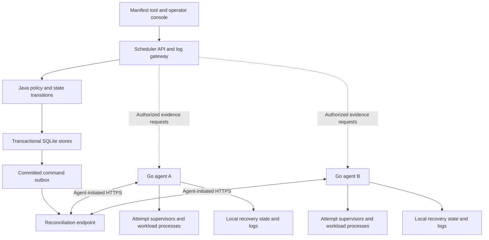

**Standalone Aurora: comprehensive unified implementation plan**

Proposal updated 2026-09-10. Implementation order: **minimum build repairs → Go execution and Mesos replacement → durable two-agent Docker lab → full Java modernization → richer execution/policy and console → migration and production capabilities**.

The first deliverable is a fresh, trusted laboratory on this Raspberry Pi: one scheduler and two Go agents in separate containers, running real batch and HTTP-service fixtures. Full Java modernization follows proof of standalone execution, so we modernize the code and dependencies that remain after Mesos removal.

Read this with the [container lab and failure matrix](PI_CONTAINER_LAB.md), [ordered implementation backlog](IMPLEMENTATION_BACKLOG.md), and [Compose blueprint](lab/compose.blueprint.yaml). The blueprint describes future images and entry points; it is not a runnable Aurora deployment today.

The native scheduler and two Go agents now form a working, authenticated Docker
cluster. The [cluster MVP guide](CLUSTER_MVP.md) records three complete recovery
rounds and the ten-minute mixed workload gate. Earlier [foundation](FIRST_SLICE_STATUS.md),
[durable core](DURABLE_CORE_STATUS.md) and [process runtime](PROCESS_RUNTIME_STATUS.md)
reports preserve the preceding increments.

CUT-01 packages that cluster as isolated runtime images with pinned tools and
content-verified dependency boundaries. Use the [native build and qualification
commands](../../build-support/native/README.md) for a fresh checkout. Following
that [qualified packaged baseline](CUT01_STATUS.md), [JAVA-01](JAVA01_STATUS.md)
has passed the same full Pi gate on Java 25 and Gradle 9, including reproducible
Java artifacts and Java 8/25 state/TLS compatibility. [JAVA-02](JAVA02_STATUS.md)
has also passed the full gate with maintained Jackson, schema validator and
logging dependencies, bidirectional state compatibility and an audit of the
retained ARM64 SQLite library. [JAVA-03](JAVA03_STATUS.md) has now qualified
HTTP/auth behavior and original installed launchers across Java 25, runtime-only
Java 26 and compiled Java 26. Each profile passed 41 Java tests, 59 launcher
commands and the complete 23-case physical gate. [The evidence](java03-evidence.json)
records all 69 physical cases and twelve sequential workload/resource trials
against the previous baseline. Java 25 remains the default; measurements are
exploratory and do not establish a production performance SLO. These completions
cover the retained native scheduler/protocol profile.

[JAVA-04](JAVA25_IDIOM_AUDIT.md) has completed the source-level Java 25 review:
647 tracked Java files inventoried, active standalone code examined, and
representative legacy findings checked independently. Its
[six ordered tasks](JAVA25_REFACTOR_TASKS.md) are complete: [JAVA-05](JAVA05_STATUS.md)
has qualified JDK helper and bounded-input changes across all three profiles,
with 46 Java tests, 61 launcher commands and 23 physical cases per profile,
plus twelve workload/resource trials against JAVA-03. [JAVA-06](JAVA06_STATUS.md)
has now qualified private records and committed polling results: 50 Java tests,
64 launcher commands and 23 physical cases per profile, plus twelve trials
against JAVA-05. [JAVA-07 and LAB-03](JAVA07_STATUS.md) have now qualified
grouped validation and lab HTTP response completeness across the three profiles,
including three compiled Java 26 recovery trials. [JAVA-08](JAVA08_STATUS.md)
has qualified store-resource and daemon lifecycle hardening across all three
profiles: 62 Java tests, 64 launcher checks and 23 physical cases each, plus four
bidirectional compatibility pairs. [JAVA-09](JAVA09_SQL_RECORD_DECISION.md)
retains the public SQL classes and Java 8 helper/source contracts.
[JAVA-10](JAVA10_CONCURRENCY_DECISION.md) completes the concurrency/HTTP design
study with six normal and six paused-agent/load trials. It retains the existing
runtime and records conditions for revisiting a bounded prototype. These Java
completions establish the baseline for the execution-capability work.

[SUPERVISE-01, THERMOS-01 and POLICY-01](P6_EXECUTION_STATUS.md) are now
qualified for the selected native profile: surviving per-attempt supervisors,
bounded native DAG/retry/finalizer execution with trusted resolved-JSON conversion,
and persistent constraints, quotas, updates/rollback, service drain and explicit
single-victim preemption. Policy is one opt-in profile with a schema upgrade.
All three Java profiles passed 73 Java tests, 64 launcher checks and 33 physical
cases each; [the evidence](p6-evidence.json) records compatibility and cleanup,
including the preserved failures. The next ordered execution slice is CRON-01.
Full Thermos parity, console work, enforcement and production migration retain
their separate gates.

**Verified master and provenance**

Both remote master refs were refreshed on 2026-09-10. At the user's request, the fork's `origin/master` was fast-forwarded by 55 commits from `d46a8d91aa69ab9cf1ebc2b13552f8093d366fe9` to Apache's current `upstream/master`, `11ebaeeb071cb182c388a40755e84f60dda32260`; the remote result was verified. Local `master` was also fast-forwarded. Implementation is isolated on `codex/standalone-foundations`, based on that upstream commit. No implementation changes were pushed to `master`. [JAVA-08 verification](java08-evidence.json) rechecked the two remote refs and local master refs on 2026-09-11; all still identify that upstream commit.

The six reports used `e3350f63d446cca17e8f1763ce30cc94346e64cf`. Its only difference from current upstream master is [AURORA_CONTEXT.md](../../AURORA_CONTEXT.md); their application-source findings apply to this baseline. All six reports and that context were copied unchanged into this branch. [Provenance and hashes](research-provenance.json) distinguish historical research from this new plan.

| Original task | Responsibility in the unified program |
| --- | --- |
| [Mesos removal](MESOS_REMOVAL_PLAN.md) | Execution boundary, inventory/reservations, native startup, transactional durability and migration |
| [Go agent](GO_AGENT_DESIGN.md) | Local admission/recovery, execution, readiness, logs, supervision and selected Thermos semantics |
| [Java modernization](JAVA_MODERNIZATION_PLAN.md) | Small early build unblockers; full JVM/build/dependency upgrade after standalone execution |
| [Simplification audit](CODEBASE_SIMPLIFICATION_AUDIT.md) | Source-backed fixes and extraction of boundaries needed by the other workstreams |
| [UI reimagining](UI_REIMAGINING.md) | Workload-to-process debugging, typed read API, then durable authorized operations |
| [Pi testing](RASPBERRY_PI_TESTING_PLAN.md) | Reproducible lab lifecycle, real fixtures, failure injection, budgets and cleanup |

**Scope and first success criterion**

Assume one scheduler, one cluster, trusted preinstalled Linux workloads and no automatic failover. Start with a batch that writes its identity and exits, plus a two-instance HTTP service spread across the two agents. A test-runner verifies identity, ports, output, readiness and termination through APIs and physical fixture evidence.

The first integrated demonstration must submit these workloads, expose state and logs, restart the scheduler with its database retained, interrupt one agent's connection while its service keeps running, issue a stop during that interruption, reconnect, and converge without unsafe replacement or resurrection. Restore a backup into a separately isolated lab and clean up all run-owned resources.

The first release advertises a process-agent profile. Full Thermos parity, uninterrupted agent upgrades, OCI images, arbitrary artifact fetching, GPUs, revocable resources, persistent volumes, HA and full browser operations have later gates. Unsupported capabilities reject explicitly. Temporary lack of placement capacity produces PENDING with a reason, rather than rejecting a supported job as invalid.

**Target components and ownership**

The scheduler owns durable jobs, desired instance membership, placement, attempt creation, quotas, updates, maintenance, reservations and command intent. The agent owns admission, actual runtime state, process retries, cleanup confirmation, readiness, logs and observation replay. The console presents these facts; it does not create another replica controller. Application data and external side effects remain the workload's responsibility.

One Go executable can run as the daemon or an internal per-attempt supervisor. The container infrastructure adds a lab-only lifetime keeper, described in the lab plan. A console API/log gateway can initially live in the scheduler process with a separately built frontend bundle.

Keep legacy public Thrift, native worker reconciliation and browser resources independently versioned. Share semantic definitions and cross-language fixtures without forcing browser requests to be identical to worker commands.

**Why this ordering**

After Mesos removal, the full Java upgrade can omit Mesos driver/native-log dependencies, Python worker packaging, old observer integration and unnecessary ZooKeeper wiring. It should not have to qualify a modern JVM against an execution platform we intend to retire.

Early build work is limited to a verified temporary toolchain, deterministic Thrift generation, Python wrapper-generator compatibility, focused tests, and separation of core resource processing from frontend packaging. Broad Jakarta migration, generated-entity replacement, style rewrites and wholesale dependency refresh belong later. New scheduler code respects the temporary compile target until the Java milestone.

Attempt historical build reconstruction within a bounded experiment and retain generated outputs. If a tool is unavailable or a necessary new library cannot run on it, make the smallest bridge supported by actual failures. Keep source-derived fixtures labeled until compared against executed legacy behavior; an unbuilt comparison is not compatibility proof.

Native Go development can proceed against a fake scheduler after contract agreement. Java behavior changes need executable relevant tests. Real integrated launches wait for transactional scheduler durability and agent recovery together.

**Decisions to settle once**

These are recommended defaults that resolve differences between the source reports.

| Decision | Proposed choice and boundary |
| --- | --- |
| Transport | Strict versioned JSON over mutually authenticated HTTPS, agent-initiated bounded long polling, Java/Go golden messages. One transport initially; gRPC is a future requirement-driven decision. |
| Scheduler persistence | Transactional SQLite for the single-scheduler lab, indexed identity/state fields and versioned payloads. SQL is authoritative for all supported paths. PostgreSQL/HA follow later. |
| Agent local store | Select one implementation through an admission/replay/corruption spike. A maintained embedded store or bounded journal must pass the same fault tests. Do not mandate a static pure-Go binary before choosing dependencies. |
| Job intake | Small strict native manifest and submit/read/stop API or CLI. Legacy Thrift remains a separate compatibility facade. No executable Python crosses the new boundary. |
| Ports | Scheduler commits exact named values; agent accepts those values atomically or rejects. Uniqueness includes network domain, protocol and address family. Docker host publication is separate. |
| Partitions | Wait for confirmed cleanup or adequate external fencing before replacement. Timeout means uncertainty. Availability-first overlapping replacement is a later explicit capability. |
| Stop and GC | Stop permanently wins for the attempt; retries never extend its deadline. Retain compact stop/terminal tombstones in Pi v1; defer compaction requiring a proven generation barrier. |
| Initial restart | Planned upgrades drain. Unresolved executions are cleaned up and reported Lost after a crash; uncertain cleanup stays reserved/quarantined. Surviving supervisors have a later gate. |
| Discovery | Fixed scheduler configuration and assigned fixture ports initially. Readiness-gated expiring endpoints come later; migrate ServerSet consumers explicitly. |
| UI | Schemas and fixtures early, small read-only views with the lab, full console and mutations after required backend contracts. |
| Compatibility | Native semantics plus a finite selected Thermos profile. Track retained/changed/rejected behavior per workload. No live Python checkpoint adoption. |

SQLite WAL requires same-host coordination and one writer at a time; FULL synchronous mode syncs the WAL at commits. Verify WAL/FULL on startup, use persistent local storage, monitor checkpoints and use the database backup mechanism. These properties do not establish this Pi's power-loss durability. [SQLite WAL](https://www.sqlite.org/wal.html), [backup API](https://www.sqlite.org/backup.html)

If using Xerial JDBC, qualify its exact ARM64 native library with the temporary JVM and this 16 KiB-page kernel early, including its native extraction directory in the container. Mesos-free does not mean native-library-free. [Xerial SQLite JDBC](https://github.com/xerial/sqlite-jdbc)

**Shared contracts and invariants**

| Contract | Required definition |
| --- | --- |
| Workload identity | Cluster/incarnation → job → instance → immutable attempt → process → run. Template revision, deployment and submission operation are distinct identities. |
| Agent identity | Stable enrolled node ID; durable journal incarnation; host boot ID; container/runtime incarnation; connection session. Daemon restart preserves runtime incarnation. Container restart changes it even if host boot ID and volume persist. |
| Specification | Explicit argv/environment/credentials; integer resource units; capability/enforcement requirements; typed port references; readiness, retry and stop policy. Define defaults before hashing. |
| Hashes | Template digest excludes replicas/update policy; assignment digest includes resolved ports and instance values. Define canonical semantic encoding, not arbitrary JSON key order. |
| Commands | Scheduler persists before send; agent persists admission/reservation before acceptance; identical ID/content returns prior result; conflicting reuse rejects. Keep immutable command body/dedupe hash separate from the current authenticated epoch/session delivery envelope, so replay can refresh authority without changing the command. Revalidate desired revision before dispatch. |
| Cleanup | Outcome and cleanup completion are different facts. Signals/deadlines alone cannot release capacity. Unknown execution stays reserved. |
| Ordering | Desired revision orders intent; per-attempt sequence orders state; per-node durable outbox cursor orders transport; scheduler committed event cursor orders UI replay. Each has explicit incarnation/recovery scope. |
| Inventory | Complete paginated snapshot with identity, generation and observation watermark. Apply after all pages, then later events. Interrupted scans never establish absence. |
| Admission | Scheduler and agent account for capacity, ports and overhead. Unsupported hard limits reject. Telemetry is not reservable capacity. Concurrent admission/drain cannot oversubscribe or override newer intent. |
| Authority | Exclusive scheduler/database ownership in Pi mode, authenticated cluster/epoch checks, explicit restore barrier. A new epoch unseen by an isolated worker does not fence it. |
| UI evidence | Desired/observed, readiness/reachability, outcome/cleanup, timestamps/freshness, completeness, retention and correlation. Encode large integer counters losslessly. |

Maintain a language-neutral corpus covering batch/service, blocked placement, process retry versus attempt replacement, duplicate commands, lost replies, stop-before-run, terminal replay, partial inventory, crash and restore. Preserve existing scheduler lifecycle/update tests. Supervisor observations enter the node outbox idempotently by `(attempt, sequence)`.

Agents journal observations before sending. The scheduler acknowledges only the contiguous committed node-outbox cursor, never beyond an uncommitted gap. That cursor is separate from the per-attempt state sequence.

**Durable desired state and one replacement owner**

Current `createJob` inserts pending tasks; `addInstances` can derive a template from an active task. Native execution needs a durable Job/revision and desired-instance record even with zero active attempts. Completed batches must not run again because a scheduler restarts and rediscovers their templates.

Validate schema/defaults outside the writer, then recheck authorization, expected revision, idempotency key, quotas and supported capabilities inside the transaction. Commit Job/revision, intended instances, initial attempts and accepted operation together. Same request key/content returns the original result; different content rejects.

Adapt the current state-machine replacement path against desired membership. Do not add another independent replica loop. Cancel/Delete removes membership and persists Stop atomically. Restart keeps membership and creates a replacement only after the cleanup/fencing policy permits it. Batch completion is durable; services retain desired membership.

**Storage and execution effects change together**

Current mutable memory storage has no rollback. Native `Storage.write` is one database transaction, with nested calls sharing the connection; inner failure makes the outer transaction rollback-only even when caught. Reads use a defined committed snapshot and caches publish only committed values.

Commit causally related state, reservations, command intent, observation deduplication/cursors and authoritative events together. Dispatch after commit. Track undispatched, uncertain, accepted and definitively rejected commands; resolve unknown commit/delivery by identity. An in-memory post-commit callback cannot replace the outbox.

Native startup restores the model, rebuilds timers/controllers and reconciles before releasing uncertain allocations. It does not wait for Mesos registration. Coordinated changes are required in `SchedulerMain`, `SchedulerLifecycle`, `AppModule`, `TaskAssignerImpl` and `StateManagerImpl`: a new Driver alone leaves native log, discovery, offers and precommit effects active.

Implement real stores for every enabled path: jobs/revisions, desired instances, tasks/events, nodes, reservations/ports, commands, observations and operations. Quotas require real storage if admission uses them. Disable cron/update/maintenance/preemption APIs and background controllers until their stores and recovery land. No no-op successful stores or volatile fallback. Exercise startup, submit, placement, status, stop, read/debug and backup to discover every accessed store.

**Ordered milestones**

| Stage | Deliverable | Exit gate |
| --- | --- | --- |
| P0 — Baseline/contracts | Current upstream branch, local research, initial cohort, capability matrix, identity/protocol decisions. | Baseline recorded and cross-component ownership/fixtures agreed. This document supplies the proposal. |
| P1 — Minimum build/lab foundations | Temporary Java/generation repairs and focused tests; pinned Go tools; image contracts, host preflight and wire fixtures. | Java core/API and native Go fixtures execute. Compose parses; image startup is a separate gate. Full JVM modernization remains deferred. |
| P2 — Native components | Neutral backend/types; Go agent against fake scheduler; transactional stores/outbox; minimal service-spread restriction and admission-disable/cordon; controller/API gating; lab harness. | Independent admission/storage/order/crash tests pass. Native commands cannot escape uncommitted writes. |
| P3 — Durable standalone lab | Commit-to-agent integration, native startup/intake, one scheduler/two agent containers, real batch/service, logs, replay and restore. | Demonstration and failure matrix pass with process/port evidence. No running Mesos or ZooKeeper service required. |
| P4 — Native dependency removal | Native package excludes Mesos drivers/conversions/JNI/log, Python worker/observer and unnecessary coordination. Quarantine legacy adapters/importers separately. | Dependency report, image contents and clean startup contain no Mesos runtime dependency; rerun P3. This precedes full Java modernization. |
| P5 — Full Java modernization | Modern Gradle/buildSrc/plugins, supported JVM, dependency families, HTTP/auth compatibility, generated artifacts, quality and distribution. | Same P3 fault corpus and relevant full Java/API/storage/distribution checks pass on target JVM; compare with pre-upgrade standalone artifact. |
| P6 — Policy, supervision and console | Surviving supervisors; selected DAG/retry/finalizer semantics; constraints/quotas, updates/rollback, drain/preemption and chosen cron behavior; read-only console, then authorized operations. | Each advertised capability has execution/recovery evidence; operator flows distinguish uncertainty and acceptance from completion. |
| P7 — Migration/retirement | Trusted export/conversion, required legacy import, discovery transition, whole-attempt drain/cutover, retention and rollback. | Required state/behavior compares; one owner per attempt; reverse migration exercised after native execution. |
| P8 — Production profile | PostgreSQL/HA, independent-host fencing/failover, enrollment/rotation, supported OCI runtime, operational recovery. | Declared failure envelope and RPO/RTO/security/runtime requirements pass. Separately scoped. |

P1 build and schema/Go work can proceed alongside one another. P2 backend, agent and harness develop against agreed fixtures; P3 depends on their integration. P5 starts after P4 and does not wait for every historical importer or production migration. UI schemas/mock workflows start at P1; small real read views join P3; the complete console and mutations follow P6 contracts.

No defensible calendar estimate exists before the first build and native-store spike. Re-estimate after P1 from observed blockers and after P3 from recovery complexity. Retain a working artifact at every completed gate. The companion backlog gives concrete PR boundaries and dependencies.

**Full Java modernization after the native slice**

Propose Java 25 LTS for deployment; qualify an exact distribution/build and supported Gradle/plugin set during implementation. Newer-feature qualification is optional. Intermediate JDK/Gradle versions isolate failures without requiring production rollout at each bridge. [Oracle support roadmap](https://www.oracle.com/java/technologies/java-se-support-roadmap.html), [Gradle compatibility](https://docs.gradle.org/current/userguide/compatibility.html)

Split P5 into build/toolchains; core DI/serialization/logging/network dependencies; and HTTP/auth/distribution. Apply compiler settings to generated sources/tests too. Preserve Thrift field IDs and immutable entity semantics; compare fixtures rather than regenerating expected data to conceal changes. Recheck remaining JDBC/native loading, ARM64 and container resource behavior.

Keep full-suite coverage/quality gates and meaningful focused tests. Preserve integration-test discovery. Make targeted fixes supported by failures. Language conveniences can simplify new internal types afterwards; virtual threads require measured blocking work and must preserve serialized writers/backpressure.

**Execution and policy expansion**

Add surviving per-attempt supervisors with a single child-reaping owner, stable runtime identity and idempotent event import. Prove daemon-only restart while children exit/logs rotate. Supervisor loss means unknown outcome and cleanup before replacement. Container recreation follows runtime-loss semantics independently of host boot ID.

Then implement the selected Thermos subset: success DAGs, concurrency, process retries, daemon/ephemeral behavior and bounded finalizers. Separate run retry from task replacement and primary outcome from finalization. Each legacy difference has a fixture, including health thresholds, shell/environment behavior and discovery.

The initial lab already needs a narrow placement rule limiting the fixture service to one instance per agent, plus durable admission-disable/cordon. Broader constraints/quotas, rolling update/rollback, workload evacuation/SLA drain and preemption follow with real stores/recovery. Revalidate victims and await actual capacity release. Cron has explicit collision/restart behavior; a retained template is not an exactly-once schedule ledger. A stronger durable run-slot ledger is separately scoped.

**Operator console progression**

The first read-only view shows workloads, instances, attempts, connection/capability state, pending reasons, process logs and freshness. Use schema-derived fixtures including PARTITIONED/unknown enums. Preserve role/environment and deep-link identities. Gateway log authorization covers cluster/workload/attempt/process/run and only enrolled agent destinations.

Start with bounded cancelable polling. Keep requested, reserved and measured resources distinct. Log cursors include source/runtime, process/run, stream segment and offset; rotation/retention/gaps are visible. Separate log throughput from lifecycle delivery.

Mutations require durable operations, idempotency keys, expected revisions, server authorization and accepted/completed/unknown outcomes. Closing a tab cannot stop a rollout. Add SSE only after committed cursors, snapshot/subscription handoff, replay, retention and gap/resync semantics. Correlate operations, commands, events and observations without treating them as interchangeable records.

**Simplification as part of delivery**

| Audit finding | Destination |
| --- | --- |
| F1 storage docs | P1: actual legacy no-rollback behavior and explicit new SQL guarantees. |
| F2 schema drift | P1 shared fixtures/UI adapter, all actual enum/state values. |
| F3 polling ownership | Small old-UI fix while useful; reuse cancellation/stale-response requirements. |
| F4 focused builds | P1 build work, implemented once. |
| F5 inert backfill | Small tested cleanup; retain live replay/translation until migration permits deletion. |
| F6 update admission | P6 extraction with authorization and state-dependent checks inside transaction. |
| F7 write/effect ordering | P2/P3 SQL/outbox after characterization of legacy ordering. |
| F8 simulator | P1 onward for deterministic policy, paired with real container execution. |
| F9 Mesos boundaries | P2–P4; migration tools can remain separately until P7. |

**Testing and restoration**

Use reducers/schema checks, storage/runtime tests, then two-agent scenarios. Repeat relevant fault cases three times, then a bounded ten-minute mixed run. Longer soaks follow measured headroom and clean shorter runs. Record commit/image identities, tool checksums, host/kernel/page size, schema versions, nonsecret config, node/runtime/attempt IDs, scenario seed, ordered traces, markers, process/port evidence and cleanup.

A synthetic RUNNING status, cross-build or Compose parse is not execution proof. The detailed [failure matrix](PI_CONTAINER_LAB.md) distinguishes daemon loss, container loss, transport failure, durability failure and enforcement.

Ordinary scheduler restart retains current database/identity and reconciles. Disaster restore is different: a backup may regress epochs, desired state and operations already observed by agents. Restore in isolation with dispatch disabled; verify the backup boundary; stop/fence the old workload pool; use a new recovery/cluster incarnation; enroll fresh or explicitly reconciled agents; invalidate old UI cursors. Incrementing an epoch from an old backup alone is insufficient.

Before native execution, rollback can return to retained artifacts/consistent state. Afterwards it must stop/fence native attempts and reconcile accepted changes before restoring desired state elsewhere. Never blindly replay an old snapshot over new work. Retain required historical readers and switch whole attempts; Python and Go never supervise the same live attempt.

**Remaining implementation gates and review**

Before P2: temporary Java/Thrift toolchain, local agent store, exact SQLite/JDBC compatibility, manifest schema and enabled-store set. Before P3: working Docker daemon access through normal host administration and actual image execution on this kernel. Before enforcement: controller availability, delegation and measured limits. Before P7/P8: real workload/discovery/retention/scale and failure requirements.

Three subagents independently reviewed sequencing/source wiring, Docker/Pi feasibility, and contracts/recovery. Incorporated corrections include the explicit post-removal Java gate, durable desired-job state, a single replacement owner, rollback-only nested writes, inventory barriers, permanent tombstones, restore incarnation, container runtime identity, network-scoped ports and separate daemon/container tests.

This task produced planning documents and a Compose design. No application implementation, package installation, container launch, host configuration change or remote push was performed.

Planning validation passed: Compose `config --quiet` and JSON rendering; inspection of all six services and three internal networks; loopback-only scheduler publication; isolation/no-socket/no-memory-limit checks; local links and whitespace across new/imported documents; and all seven imported source hashes. Docker daemon access remains denied, so image execution and application behavior remain future gates.
